# Decision table

Building a product finder, a skin type test, or something similar was never so easy as with the decision table! You do not have to add every condition to each module. 
For this article, you should know how variables work. If you need help with that, read this (LINK) article first.
To use a decision table you need a questionnaire, a decision table, and some outputs. Outputs can be every process brick. Those are what the customer will see as a result. In this example, we will build a test on which hobby suits best for the customer. As a result (outputs) we have swimming, cycling, and jogging.

  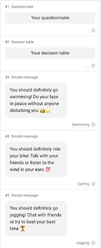

For example, in a product finder, this would be the product gallery with products that suits best your customer.

### Add a questionnaire
First, you add the questions you want to ask. Add at least two questions. For fewer questions, it does not make sense to use a decision table.

  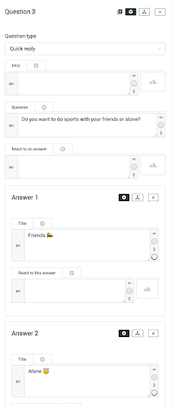
  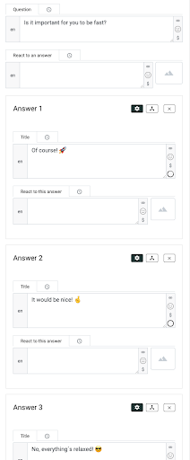
  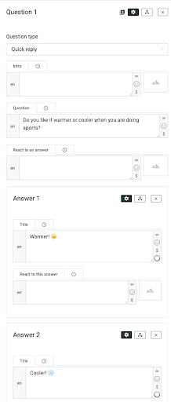

Then you choose process variables and values for each question and each answer (LINK TO VARIABLES). Pay attention to the correct spelling!

### Working with the decision table
Now you open the decision table. We need to add as many inputs as you have added questions. Therefore click on “Input +”.

  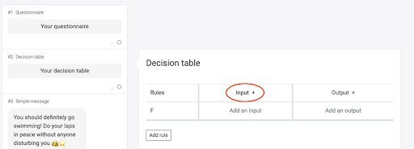

Afterward, add an output by clicking on “Output +”. 

  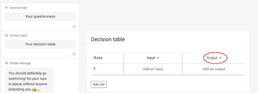

Next, click on the first field under “Input” and select “process variable”. Fill in the name of the process variable of your first question. In the other field under input, you do the same with the other process variables. 

  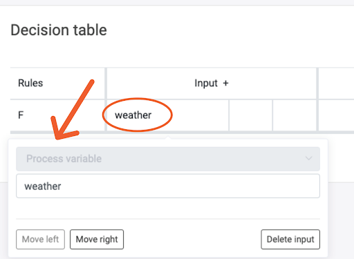

Then, click on the field under “Output”, choose again “process variable”, and add a new name. Do not use a name that you have already used. You can use for example “skin type” if you do a skin type test or you can use “product” if you build a product finder. Select 'process specific' for 'Variable scope' if you want the variable to be used only in this experience and 'process independent' if you want the variable to be usable in other experiences as well.

  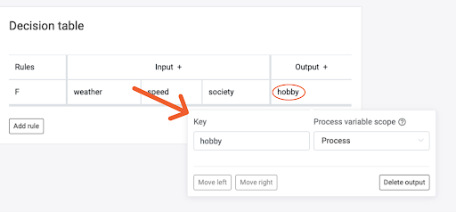

As a next step, add a new rule.

  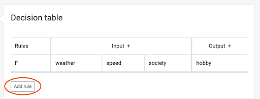

With this, you determine the combinations of your questionnaire. For example, you have three outputs: jogging, cycling, and swimming add a rule for every 
combination after which comes jogging as an output. Because of length, we do only three combinations. Afterward, the system will be clear. If the first 
combination is clicked by the customer the hobby will be cycling. So we add in the fields of the first rule values which suits. The system is similar to 
the variables at process bricks. Click on the field under the first input. Choose an operator and add the fitting value. This has to be a value that is 
set in the first question.

  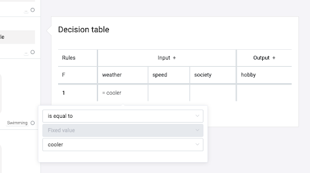

Then you add the values in the other fields of your inputs too.

  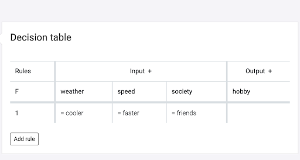

Next, you fill in the “Output”. Therefore click on the field under hobby. Choose a fixed value and add a name that is meaningful. In our case, we will use swimming, jogging, and bicycle. 

  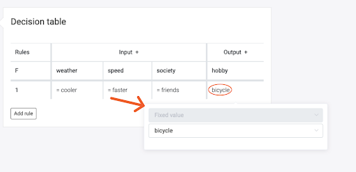

Now the first rule is ready. If this combination is clicked, the consumer will get “bicycle” as a result. You need to rule every possibility because else the chatbot does not know what to send. There would be no output then.

  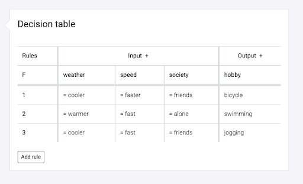

### Choose your process bricks
As the last step, you need to condition your modules. Therefore click on the small circle at your process brick. 

  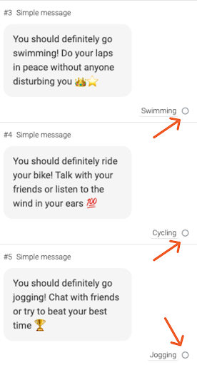

Then choose “hobby” as a process variable in the first field and your output (swimming, jogging, or cycling) as a fixed value in the third field.

  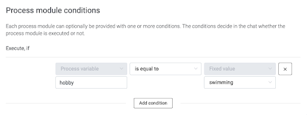

That's it! Now your chat is customized to the customer's responses.

   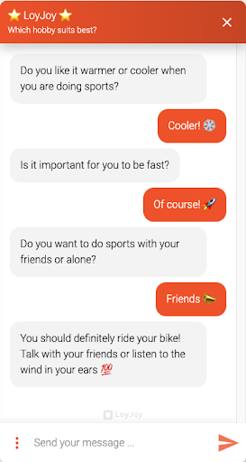

