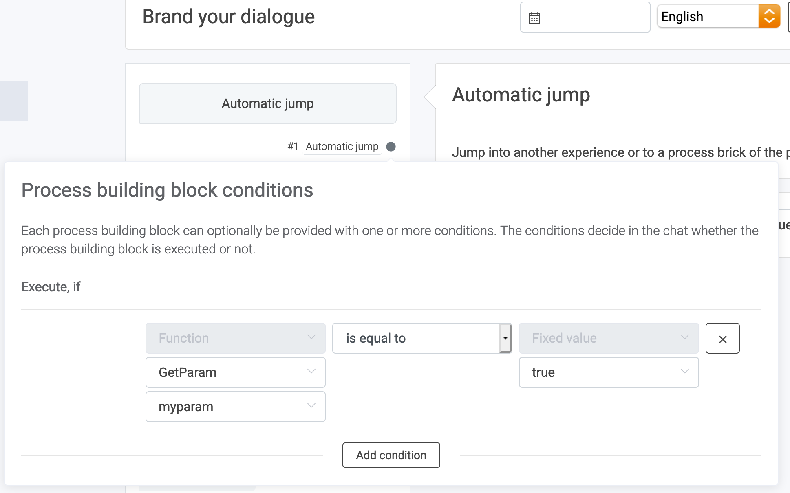
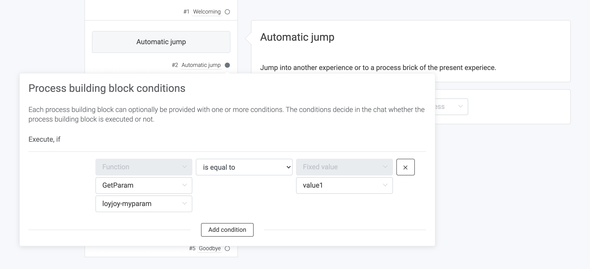
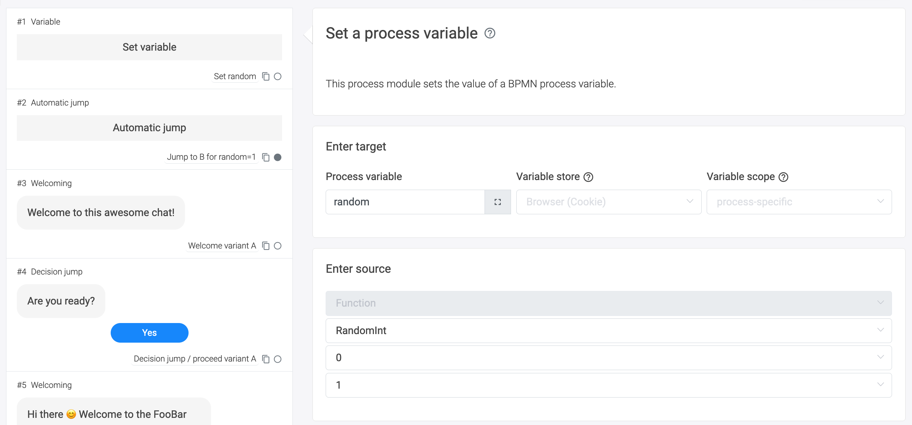
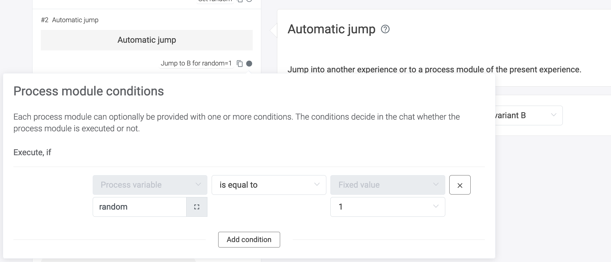
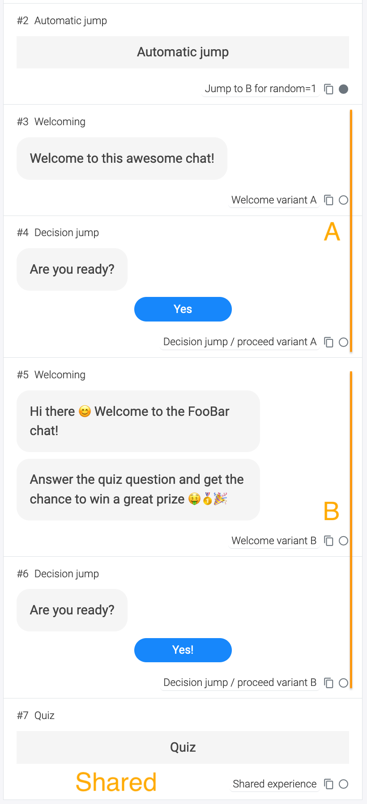
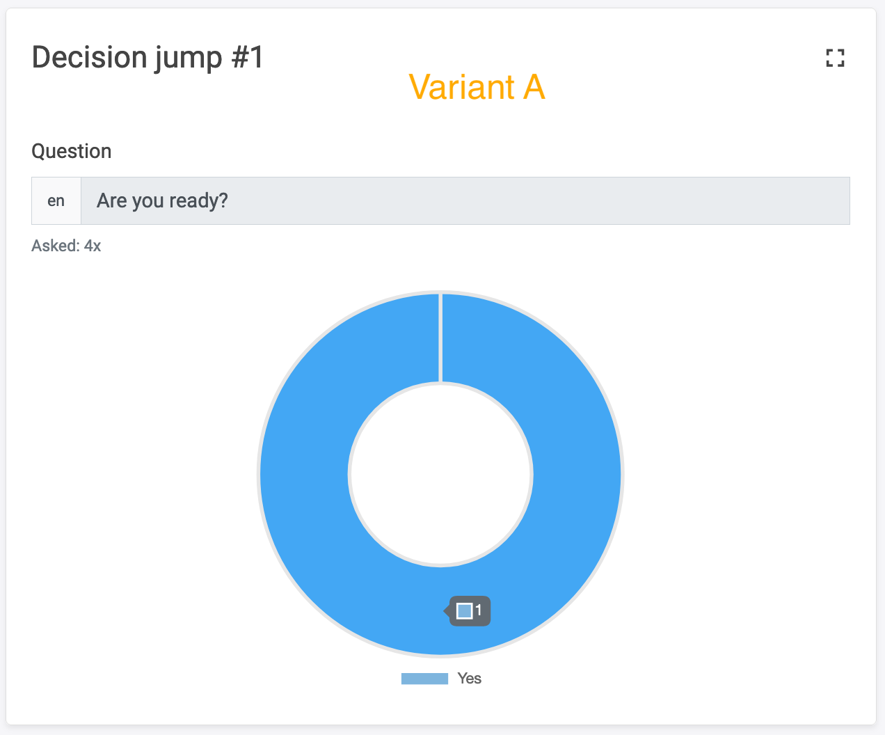
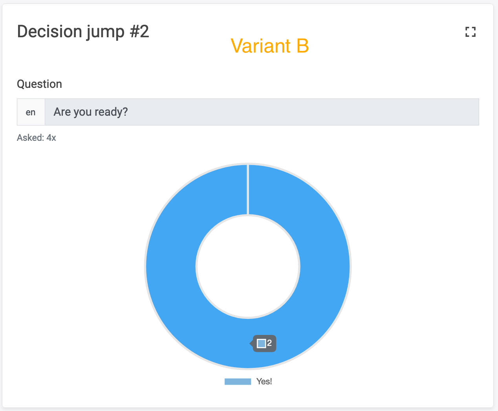

# How to conduct A/B testing in LoyJoy

## 1. What this solution will do for you

This article is right for you if you want run an A/B test with two (or more) different chats on the same website.

## 2. What you need for this solution to work

This article offers three different options for A/B testing. The first two options require to modify JavaScript on your website. The third options works by just adding a parameter to the URL.

## 3. There are fourc options for A/B testing

There are three ways to have dynamic experiences on one landing page:
- Switching experiences in the website's JavaScript
- Switching experiences in LoyJoy based on parameters from the website's JavaScript
- Switching experiences based on freely defined URL parameters
- Switching inside one experience base on a random 50/50 split in LoyJoy

## 4. First option: switching experiences in JavaScript

You can `boot` LoyJoy with different processes, depending on conditions you choose.

One common condition is a URL parameter. See this example:

```javascript
const loyjoyParam = getParameterByName("loyjoy-process");

let process;

if (loyjoyParam == null) {
  process = "<default-process-id>"; // default process
} else if (loyjoyParam === "param1") {
  process = "<quiz-process-id>"; // alternative process when loyjoy-process = param1
}

LoyJoy("boot", {
  "bot": "<bot-id>",
  "process": process
})
```

Here, `loyjoy-process` is the URL parameter we chose to determine which process to `boot`. `getParameterByName` is
simply a function that gets us the value of URL paramter.

## 5. Second option: switching experiences in LoyJoy

When booting LoyJoy, we can hand over arbitrary parameters:

```javascript
LoyJoy("boot", {
  "bot": "<bot-id>",
  "params": {
    "myparam": user.hasCamera
  },
  "process": "<process-id>"
})
```

The parameter `myparam` is now freely available in LoyJoy. Parameter names can be chosen freely.

Inside LoyJoy, we can access this parameter and, for example, make an automatic jump based on it:





Here, we trigger an automatic jump, if the given parameter is has the value `true`. This jump can lead
to a specific position in the process or to another process altogether.

## 6. Third option: switching experiences with URL parameters

Let's say your website has the URL `https://www.example.org`. Just use two or more parameters that you can access in LoyJoy like this:

`https://www.example.org?loyjoy-myparam=value1`

and

`https://www.example.org?loyjoy-myparam=value2`

It is required that the param name starts with `loyjoy-` so that LoyJoy can identify it. After the `loyjoy-` you can add a custom name for your parameter. If you need more than one parameter, connect the parameters with an `&`, for example `https://www.example.org?loyjoy-myparam=value1&my-tracking=trackig-code`.

Inside LoyJoy, we can access this parameter and, for example, make an automatic jump based on it:





Here, we trigger an automatic jump, if the given parameter is has the value `true`. This jump can lead
to a specific position in the process or to another process altogether.

## 7. Fourth option: Switching inside one experience base on a random 50/50 split in LoyJoy

For this approach we first need to set a random variable that sets up the 50/50 split:


The next step is an automatic jump that will lead half of the users to variant B of the chat. The other users do not jump and and will simply arrive at variant A that is positioned right after.


At the end of variant A and B there is a decision jump. This allows us to count independently how often this point was reached and how often users proceeded to the next step:











Here we can see that both variants were shown 4 times, 2 of the users in variant B continued and only one in variant A.
