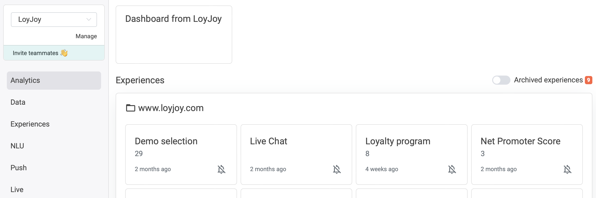

# Drill-down

#### Track the performance of your live chatbots, better understand your customers' behaviour and see your KPIs skyrocket by using the LoyJoy Analytics Dashboard.

[*See also Analytics FAQs*](/faq/analytics/analytics.md)

## 1. Find your way

+ You can find your aggregated, tenant-wide KPIs under "Dashboard" at the top of the page and the performance of the individual experience in the view in the respective folders.  

+ By clicking on the chart icon, you can easily access the KPIs of **each experiece**  

+ If you click on the bell icon, you can sign up (or unsubscribe) for a **daily report** by email on the performance of each experience:

+ There are two tabs in this view: [KPI](/analytics/kpi/kpi.md) & Drilldown. The KPI tab shows the aggregated numbers and general charts for this experience. The drilldown tab shows the heatmap depicting which process modules were visited how often and allows you to click on each module to analyse module-specific data.

_____________________

## 2. Drill-down tab at a glance

The drilldown tab shows a sequential view of the different modules that make up an experience. For each of the modules it shows the number of times this module was shown. Laid over the the modules is a heatmap that visually indicates the relative frequency (blue over green and yellow to red from low to high).

## 3. Which numbers are displayed (Drill-down-Tab)

A color visualized heatmap shows how often each of the modules were displayed. The color gradient from blue to green to yellow to red shows a low to high 
frequency.
If you click on the individual modules, you will get more detailed information. For each module, it is indicated how often it was passed through. For some 
modules, there are also additional KPIs. These are explained in more detail [here](#51-web-push-opt-in).

3.1. [Web push opt-in](#31-web-push-opt-in) 
3.2. [Share link](#32-share-link) 
3.3. [NPS Survey](#33-nps-survey) 
3.4. [Sign in](#34-sign-in) 
3.5. [Decision Jump](#35-decision-jump) 
3.6. [Loyalty points](#36-loyalty-points) 
3.7. [Rewards](#37-rewards) 
3.8. [Opt-ins](#38-opt-ins) 
3.9. [Quiz](#39-quiz) 
3.10. [Instant win](#310-instant-win) 
3.11. [Giveaway participation](#311-giveaway-participation) 
3.12. [Coupon code](#312-coupon-code) 
3.13. [Appointment scheduler](#313-appointment-scheduler) 
3.14. [Code entry](#314-code-entry) 
3.15. [Personal data](#315-personal-data) 

### 3.1. Web push opt-in
Here you can see how often the web push opt-in was asked for, how many single and double opt-ins were given and how many times the single opt-in was rejected

### 3.2. Share link
Here you can see how often the chatbot was shared via Facebook, email, Twitter, Whatsapp or the link.

### 3.3. NPS Survey

#### NPS segments
This diagram shows the distribution of [detractors](/analytics/kpi/kpi.md#detractors), [passives](/analytics/kpi/kpi.md#passives) and [promoters](/analytics/kpi/kpi.md#promoters). If you hover over it, you will also see the 
absolute number.

#### NPS distribution
In this chart you can see the NPS scores per score.

#### NPS answers
Download the answers (typed content) of the customers in the NPS rating here. You can choose between the three categories [detractors](/analytics/kpi/kpi.md#detractors), 
[passives](/analytics/kpi/kpi.md#passives) and [promoters](/analytics/kpi/kpi.md#promoters).

### 3.4. Sign in
Here you get an overview of how many customers have signed in and how often the pin email was sent. You can also see how often the pin was successfully or 
unsuccessfully entered. In addition, the new customers are also counted. These are customers who enter their email address for the first time.

### 3.5. Decision Jump
Look at the split of how many clients chose which options

### 3.6. Loyalty points
This module provides you with information on how many loyalty points have been awarded, how many different customers have received these points and how many 
rewards have been redeemed.

### 3.7. Rewards
Here you can find out how many points have been redeemed in total and how many rewards they have been distributed over.

### 3.8. Opt-ins
For the opt-in modules (profiling, reminder, SMS and newsletter), you can see how often single or double opt-ins were given, how often single opt-ins were 
rejected and how often opt-outs occurred.

### 3.9. Quiz
See here how many correct and incorrect answers were given and how many pictures were uploaded. You also get an overview of the answer distribution for the 
individual quiz questions.

### 3.10. Instant win
Here you can see how many different participants there were and how many in total. You can also see how many participants won and how many lost.

### 3.11. Giveaway participation
Here you get an overview of how many different customers have participated and how many in total.

### 3.12 Coupon code
Get an overview of how many coupon codes have been uploaded, how many codes have been distributed and how many codes have been entered.

### 3.13. Appointment scheduler
Get an overview here of how many appointments have already been booked

### 3.14. Code entry
Here you can see how many codes were entered, how many of them were correct and how many of them were wrong.

### 3.15. Personal data
In the modules that request personal data (birthdate, first name, phone number, postal address), you can see how many customers have entered data.

