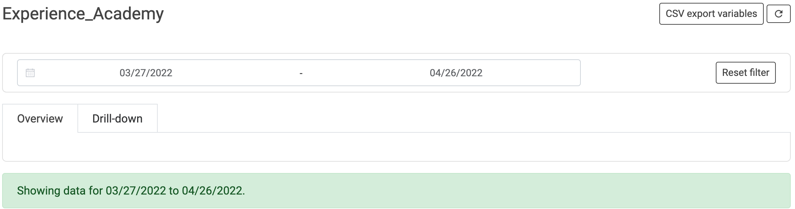
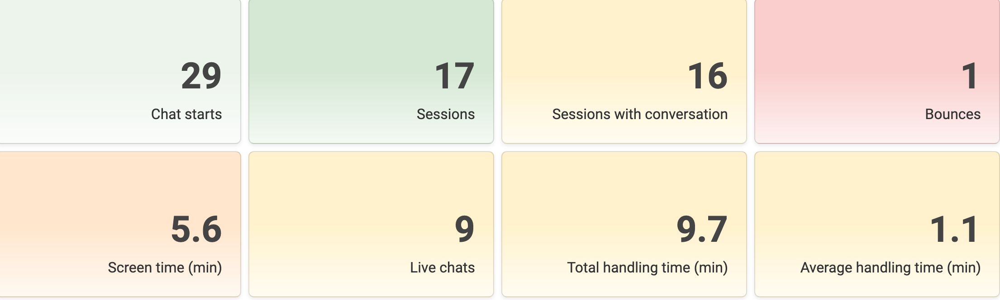
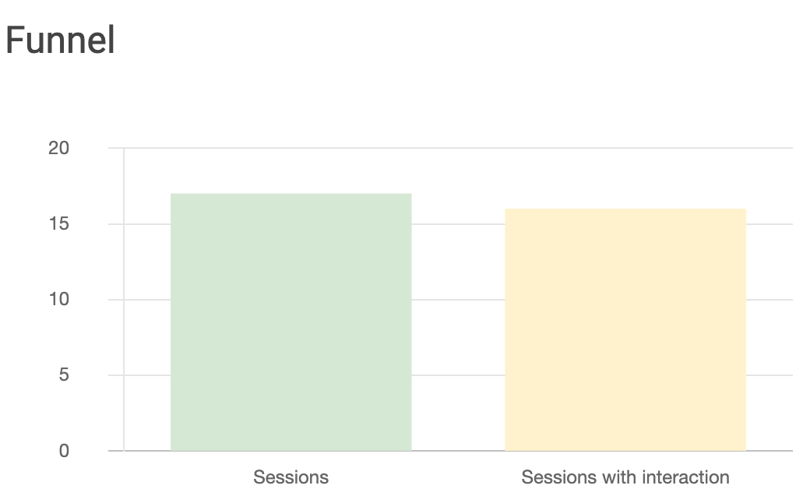
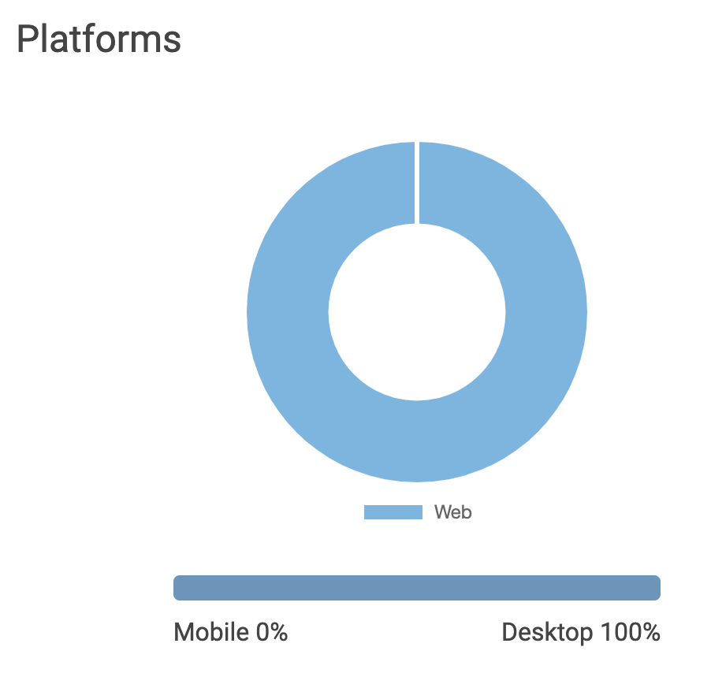

# Overview 📈

- [Introduction](#introduction)
- [Analytics](#analytics)
- [Visualization](#visualization)

## Introduction
Track the performance of your live experiences, better understand your customers' behavior and see your Key Performance Indicators (KPIs) skyrocket by using the LoyJoy Analytics Dashboard.
________________________

## Analytics

Once you are in the Analytics tab, you can find your aggregated, tenant-wide KPIs under _Dashboard_ at the top of the page and the performance of the individual experience in the view in the respective folders. By clicking on the chart icon, you can easily access the KPIs of **each experiece.** If you click on the bell icon, you can sign up (or unsubscribe) for a **daily report** by email on the performance of each experience. There are two tabs in this view: Overview & [Drilldown](/analytics/drill_down/drill_down.md). The Overview tab shows data such as KPIs and general charts for this experience. The _Drill-down_ tab shows the heatmap depicting which process modules were visited how often and allows you to click on each module to analyze module-specific data.

### Essential data displayed

Here you get the most important numbers in a brief overview with colorful tiles (Tip: Hover over them to get more detailed information).
You can select here for which period the data should be displayed. The selection will affect all tabs and views. 

 Essential data displayed includes: 

- Chat starts (Chat starts are recounted individually for each experience
- Sessions (new session is counted every 30 minutes)
- Sessions with conversation (counted as soon as the customer interacts)
- Bounces (counted when customer has neither typed anything in the chat nor clicked on a button)
- Screen time (Total screen time spent by all customers within this experience in minutes)
- Live Chats
- Total handling time
- Average handling time

### Advanced data displayed
Advanced data displayed includes:
  -   Asked for Web push
  -   Single/Double opt-in
  -   Shared via Facebook/email/native/Twitter/WhatsApp
  -   Participations
  -   Net Promoter Score

[*See also Analytics FAQ*](/faq/analytics/analytics.md)
________________________

### Visualization
Data can be also viewed visualized. 

**KPIs over time** 
- In this chart you can view the individual KPIs over the specified time period or over the entire time period

**KPIs over time cumulated**
- In this diagram you can view the individual KPIs cumulatively over the specified time period or over the entire time period.

**Funnel**
- Here you can see the individual KPIs in a funnel.

**Platforms**
- Here you can see how your customers are split between mobile and desktop.

**Further illustrations**
- Log-in attemps with code: shows how often the log in attempt with code worked and how often it did not.
- Data entered by customers: see what data has been entered by customers, such as the postal address
- NPS visualization
   -   NPS segments: shows the distribution of [detractors](#detractors), [passives](#passives) and [promoters](#promoters)
   -   NPS distribution: see the NPS scores per score.
   -   NPS answers: Download the answers (typed content) of the customers in the NPS rating here. You can choose between the three categories [detractors](#detractors), [passives](#passives) and [promoters](#promoters).
