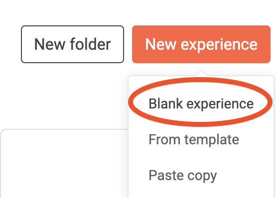
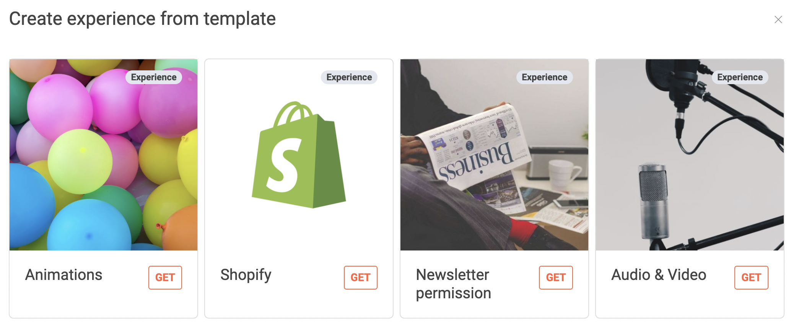
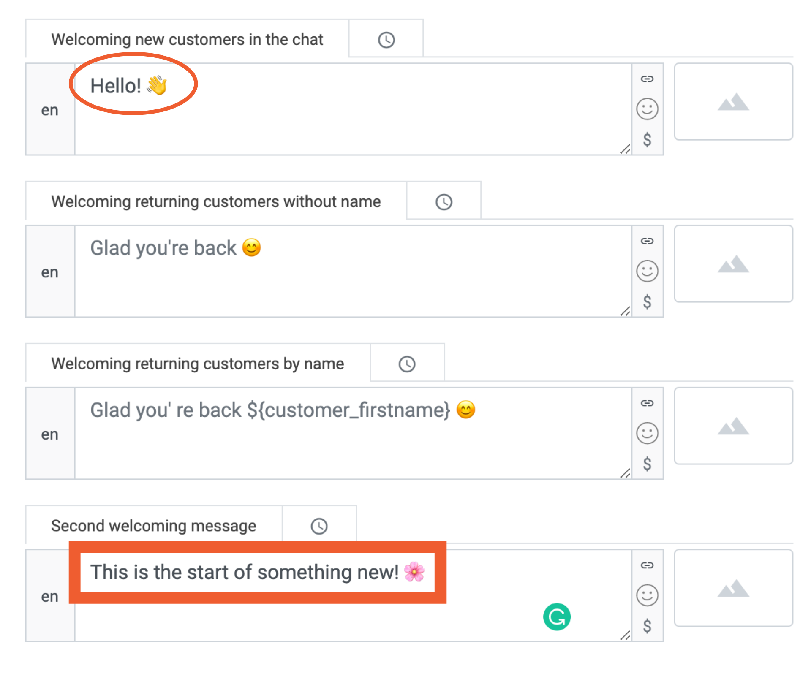
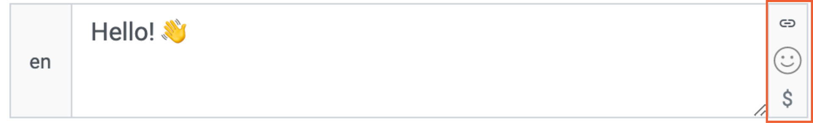
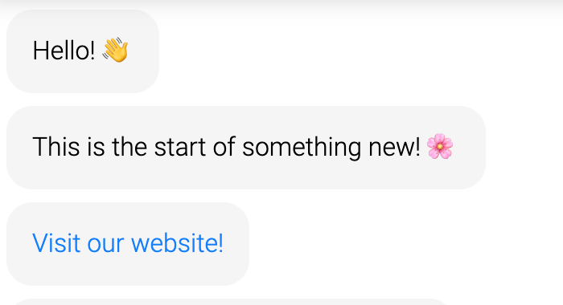
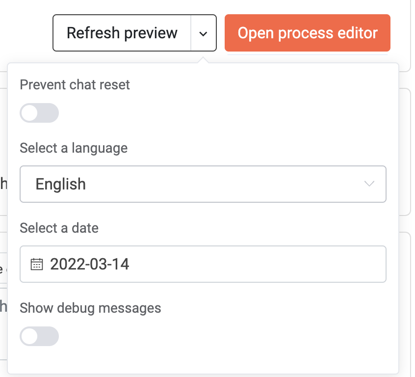

## How to Set up a Chatbot

In the backend, you can have several starting points. You can either start an experience by using a copy of an existing one, you can use our ready-to-use experiences from our template store that give you a process flow to customize yourself, or you can start from scratch with a blank process.

  

#### Option 1: Copy an existing Experience/Folder

Imagine your colleagues have built an amazing chatbot experience which got your inspired to start your project. To benefit from their work, you can simply copy their experiences and work on your customizations and modifications with the copy. Click on the three dots of the chat experience or a whole folder of experiences you wish to copy and select "Copy".

  

Now click "New Experience"/"New Folder" on your start screen. Or you paste the experience in the Folder in which you want to add it. Simply paste the copied link.

  

Now you can open your experience and rename it to your wishes. Great! Now you can start [editing your chat experience](#the-chat-flow-editor)! 🎉

#### Option 2: Create a New Experience

To build your own experience, click on "Create Experience".

  

Now decide whether you make use of our great ready-to-go experience or if you prefer to start from scratch. We recommend checking out the ready-to-go experiences as they provide you with the logical structure of your chat flow based on your objectives. 

 

 

Amazing! Let's start customizing your experience to your wishes! 

#### The Chat Flow Editor

Let's dive right into the Process Editor, the heart of every chat flow. On the left side, you can find [all basic process modules](https://github.com/loyjoy/welcome/blob/master/documentation/process_building_blocks/PROCESS_BUILDING_BLOCKS.md) to use for your chat flow. Simply drag and drop the process modules into your flow.

  

Once you have added all your process modules, the next step would be editing. Click "Close process editor" to open the Chat Flow Editor.

  

Feel free to insert your prefered text into the text fields. Click on each process modules to edit its texts.

  

To add hyperlinks, emojis and variables to your texts, click on the small button at the end of each text field. 

  

Adding a hyperlink to your text will require a link text (in square brackets) and an URL link (in round brackets).

   

This is how a hyperlink looks like for the user.

  

Select exciting emoticons to engage emotionally with your consumers. Take advantage of our selection, where all emoticons are checked for aesthetics on all operating systems. But you are not limited - Insert any emoji by simply pasting it into the text field.

  

Add variables to individualize your texts for every customer. Address them by their first name when returning to your chat, provide content-specific data or link variable data to your text field. 

  

To make sure you stay on top of your chat flow, you can name your process modules according to their use. This helps you to navigate through your flow when complexity grows.

  

Now it is time to try out what you have built up so far. Here you can also define whether the chat recognises you as a "returner", on which day the chat should be played (only makes sense if a timer is also set on the modules) and in which language the chat should be displayed. 

Hit "Refresh Preview" and open the chat window by clicking on the chat bubble at the bottom. 

  
  

Your chatbot will open and you can check out your progress. Whenever you wish to restart the flow, simply press "Refresh Preview" again.

  

Do not worry about saving your progress. We have your back! Every edit is automatically saved.

## How to Adjust the Branding

Let's brand your chatbot to your preferences together. Give your chatbot a name and attract customers with a slogan. Add a placeholder for the open text field, if you wish so.

  

Then you can add the logo to your brand. It will appear in the upper right corner of the header of your chatbot.

  
  

You can also choose the main colour for your chatbot matching the brand's style.

  
  

An email address must be set to address customer inquiries.

  

Before a chatbot goes live, an imprint must be set.

  

If you are sending emails through your mail domain, please fill out the following fields. Ask your LoyJoy Success Manager for assistance.

  

Some consumers will type something into the open text field at the bottom of the chatbot. To respond to customer input, we provide standard intents to respond empathically to customer inquiries. However, in some cases, our AI algorithm will not identify the input. Define a message to send out to your customers in that case or let them fill out a contact form so that the inquiry can be addressed personally.

  

You can set fixed buttons in your chatbot to offer your customers the option to jump right into a certain action by using our persistent quick replies.

  
  

## How to Manage Content

Your chatbot will contain multiple types of content. This chapter aims to show you where you can set and translate your language, manage your assets, export the giveaway winners and adjust your texts.

### Translate your Language

Our chatbots run globally. However, you will launch your chatbot in a market with a specific language. To still benefit from chatbots in a different language, you can use our built-in translator. Choose the "Language" tab and then select your language. Scroll down to translate your chatbot from the existing language to yours.

  

You can also build your chatbot in more than one language. A text field will appear for every language selected in the Chat Flow editor.
Now enter your default language.

  
  

