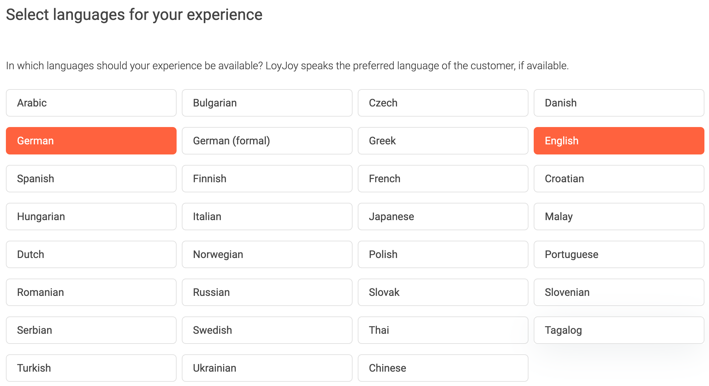
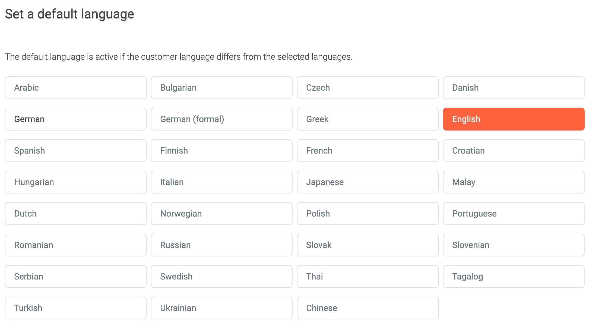
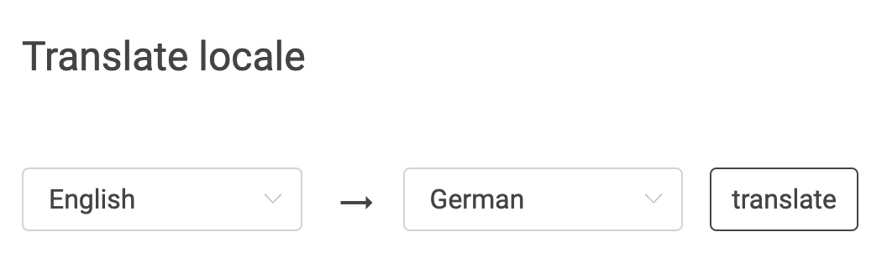
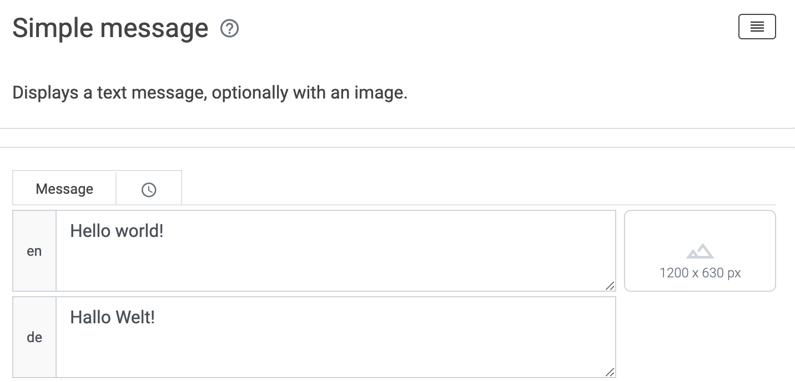

# Translate your Language

Our chatbots run globally. However, you will launch your chatbot in a market with a specific language. To still benefit from chatbots in a different language, you can use our built-in translator. Choose the "Language" tab and then select your language. Scroll down to translate your chatbot from the existing language to yours.

You can also build your chatbot in more than one language. A text field will appear for every language selected in the Chat Flow editor.
Now enter your default language.

Placeholder

Placeholder 

