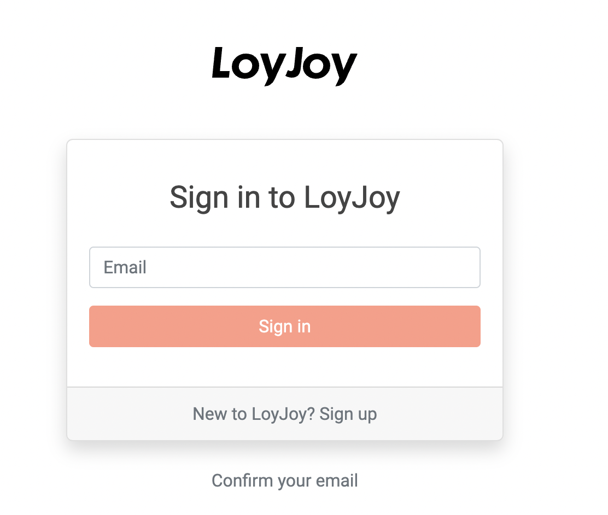

## How to Log in

After your first call with the LoyJoy team, you will receive an email inviting you to the LoyJoy platform. Please click “Confirm my account” within 24 hours to activate your access your tenant on the LoyJoy platform. Think of your tenant as being your team's playground to create chat experiences and much more. 

  

After confirming your account, please type in your email address to access the tenant.

  

Everybody has troubles remembering passwords. That's why re retires the password for good. Each time you will log in to the LoyJoy platform, we will send you a magic link via email. Click the link in the email to access the platform.

  

Tada! Welcome to the LoyJoy platform. It's where the magic happens! 🎉

