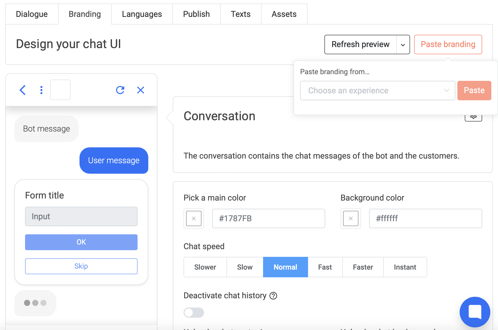
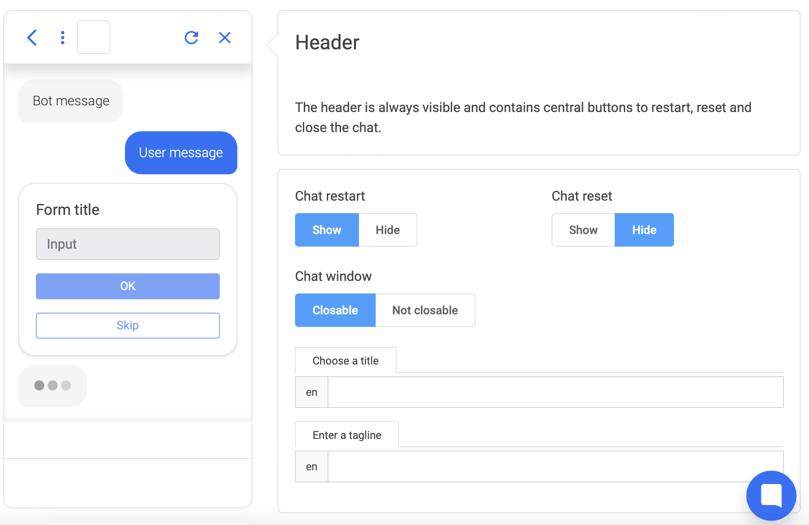
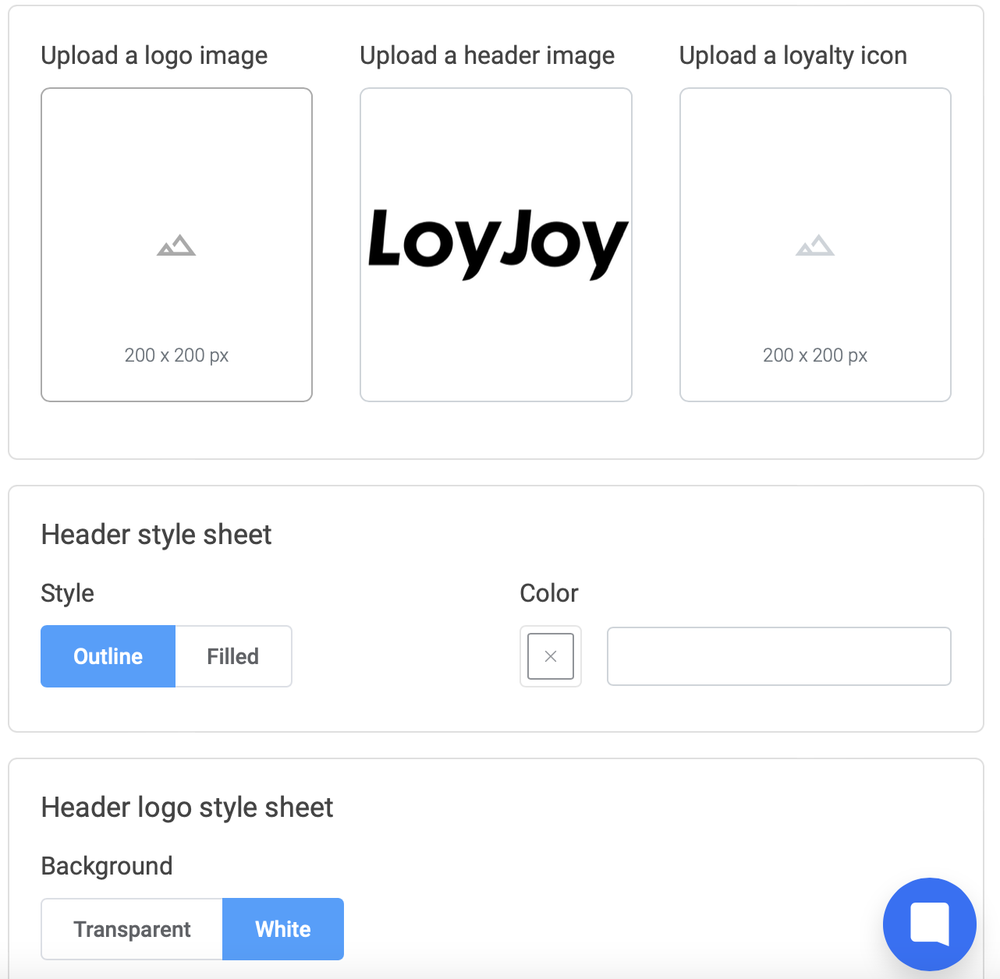
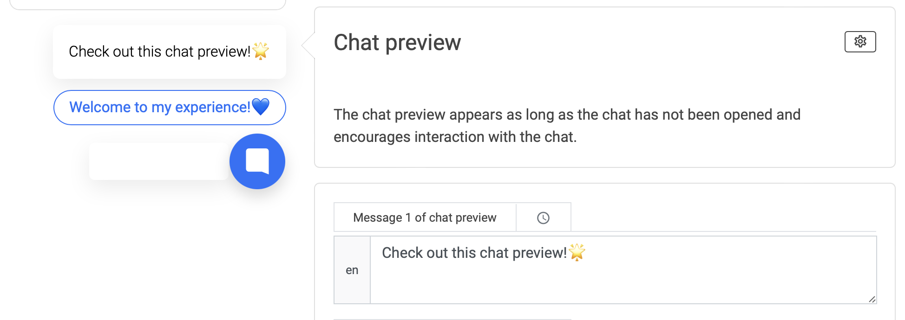
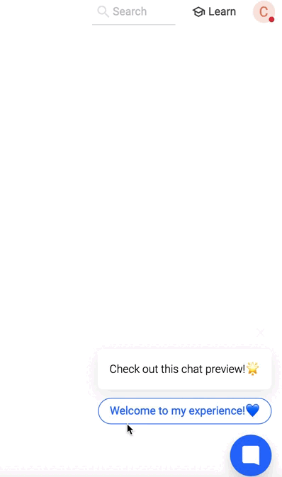
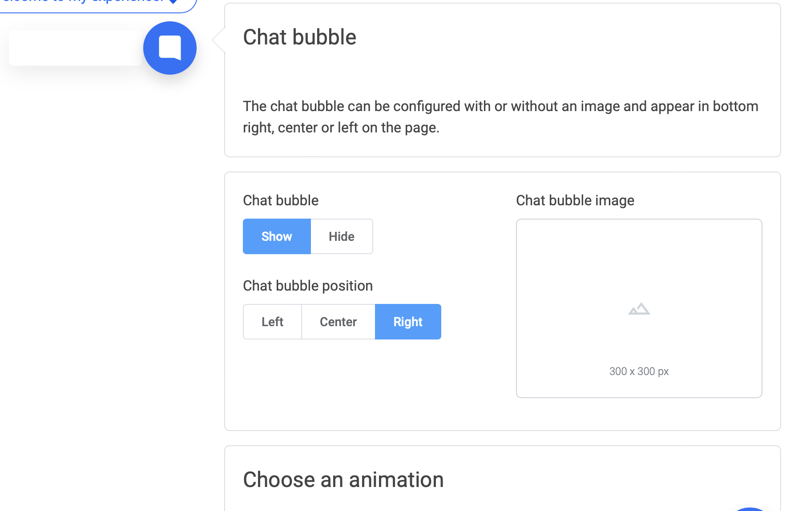
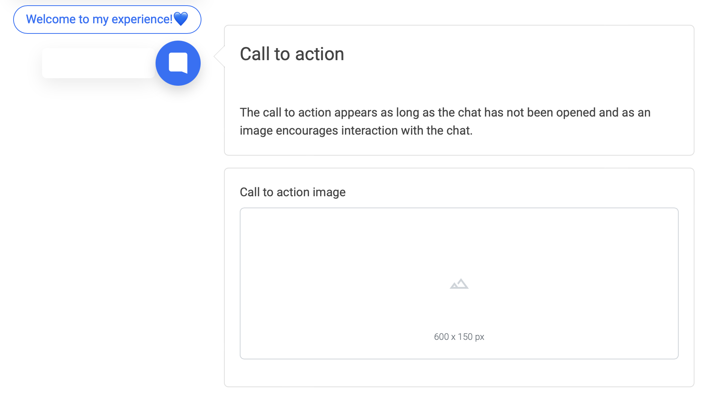

# How to Adjust the Branding

Use our Branding options to design you chat UI and create powerful experiences. Give your chatbot a name and attract customers with a custom slogan or design. You can transfer brandings from one experience to another or create new ones for every individual experience. 

## Paste branding 

If you already have a standardized branding that you wish to transfer to another experience, just use the *Paste branding* button you will find under Branding. Here you are able to paste any branding from another experience in your tenant. By pasting the branding all your previously made settings will be transferred to this experience. 

## Create new branding

If you want to personalize your individual experiences, you can create new brandings for every experience. Let's brand your chatbot to your preferences together.

### Conversation

First, you will find the Conversation settings. Here you can pick the main color of your experience to match the brand’s style. Manage your chat speed and personalize the experiences by inserting a chat avatar image or a chat background. Remember that we recommend that pictures are **no larger than 500 kb**, furthermore, you can find the recommended px size in the designated area!

You can also find the individual settings for desktop or mobile use. Choose individually if you wish the experience to open initially or open more than once. You are also able to adjust the chat window position and window width for the desktop experience. 

### Header 

Click on the header in the chat animation to your left. You will find the Header settings. Here you are able to manage the settings about the chat header and the restart options. 

To create the design you want, choose a title and a tagline or insert a logo image, which you will see on the left side of the header, a header image, which you can see in the middle of the header, or loyalty icon.

* #### Home 

> By clicking on the arrow pointing to the left in the chat animation you can select a home view for this experience and can manage to show the home view initially, as soon as the chat window is open. 

* #### Navigation 

> Find the three dots next to the arrow in the header chat animation to manage your sign-in or -out options, enable imprint or enable the chat restart and reset. Before a chatbot goes live, an imprint must be set.

### Persistent quick replies 

You can set fixed buttons in your chatbot to offer your customers the option to jump right into a certain action by using our persistent quick replies. To manage your quick replies in the footer of your experience, click on the space above the footer in the chat animation to the left.  Enter your quick replies and guide your customers into another experience. You can choose up to five quick replies.

### Footer 

In the Footer settings you are able to activate or deactivate the input field. If your customers will not need the input field and your experience is not trained in NLU, we recommend to deactivate the input field for an overall better conversation. 

If you use our NLU features, under the Footer settings, you are able to activate the NLU and choose responses to unrecognized intents.
Some consumers will type something into the open text field at the bottom of the chatbot. To respond to customer input, we provide standard intents to respond empathically to customer inquiries. However, in some cases, our AI algorithm will not identify the input. Define a message to send out to your customers in that case or let them fill out a contact form so that the inquiry can be addressed personally. An email address must be set to address customer inquiries.

* #### Footer web components 

> You are able to enter Footer web components to the footer by entering the wished URL and HTML tag. 

### Chat preview 

Use the chat preview above your chat bubble to excite and motivate your customers to click on your experience. You can also offer up to three quick replies in your chat preview. Your customers can use these to jump into another experience or to a process module.

### Chat bubble 

Click on the Chat bubble to the left to customise your chat bubble image, the chat bubble position or choose an animation. A little *hint* from us: We also support moving Gifs as Chat bubbles!

### Call to action 

A call to action can be a powerful tool to  animate your customers to engage with your chatbot. Insert a call to action image in the recommended size that will show up left to your chat bubble. 

