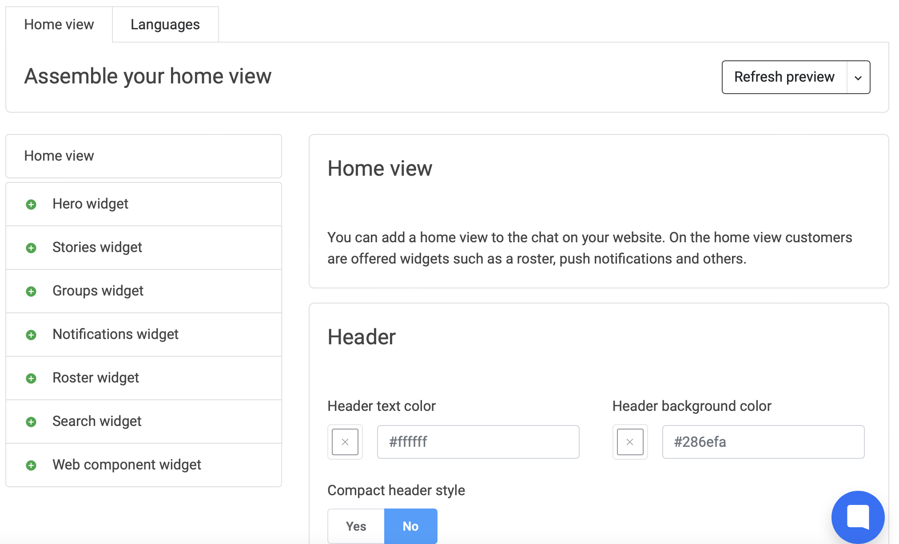
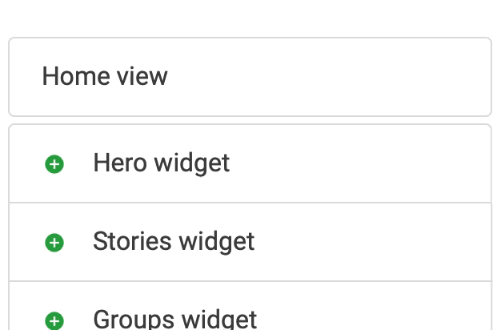
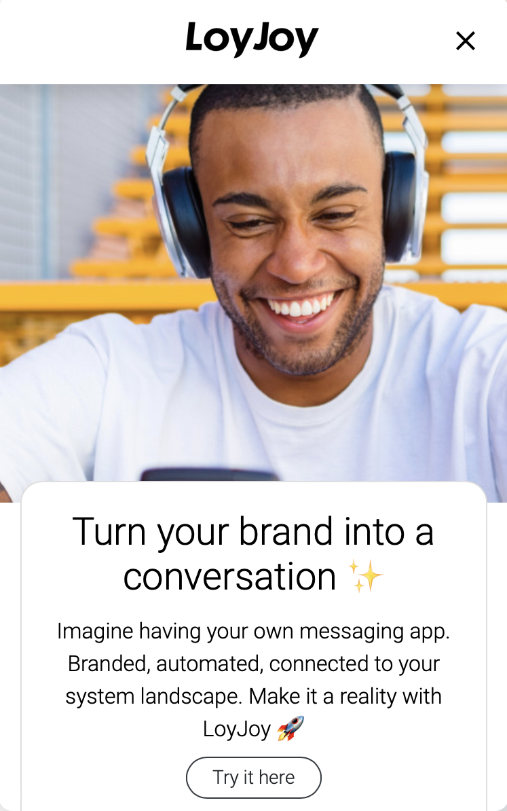
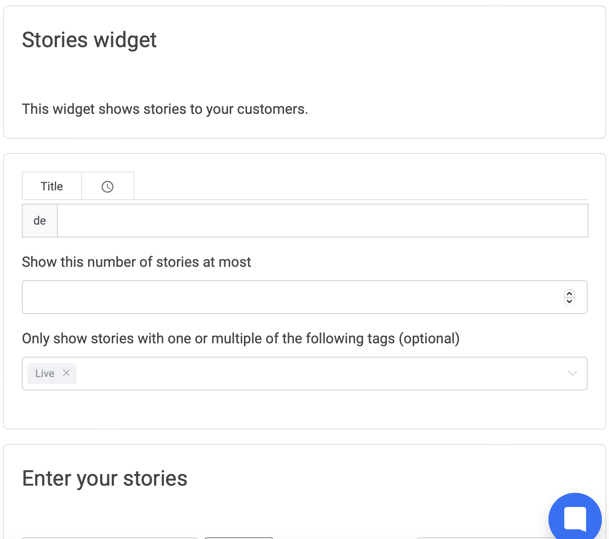
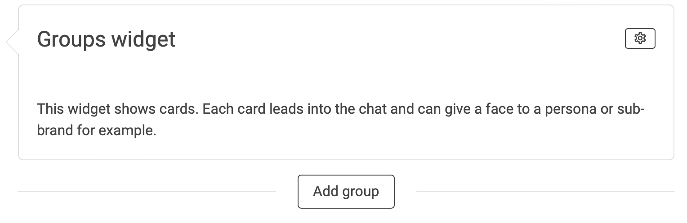
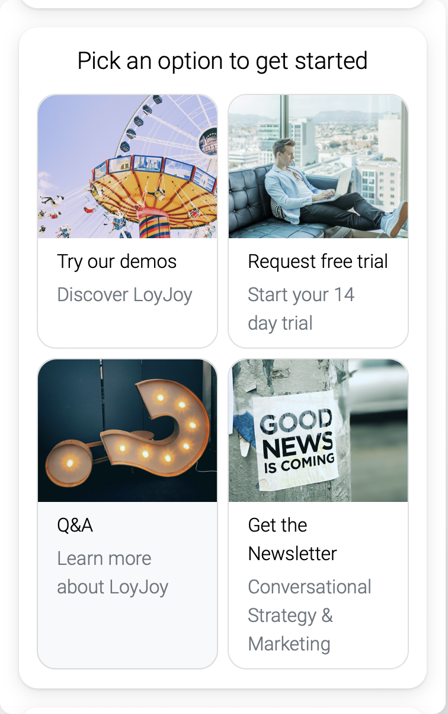
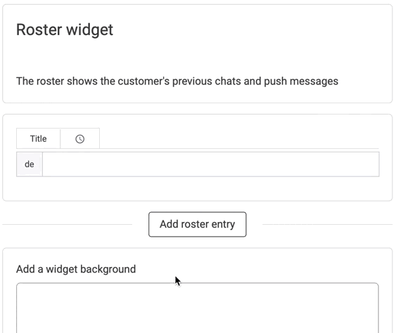

# How to build your LoyJoy Home View

Are you ready to take your chat experiences to the next level and discover the possibilities of the LoyJoy Home Screen? Great - You are in the right place!

This article will guide you through the features of the LoyJoy Home View and explain how to use them in the best ways. The Home View lets you create a responsive web application to easily navigate through different customer experiences. In addition to your well-known LoyJoy experiences, let me introduce you to our LoyJoy Stories. Present your content in exciting social-media-like Stories and discover the new era of Conversational Marketing!


Check out the different Home View components:

- [Hero widget](#hero-widget)
- [Stories widget](#stories-widget)
- [Groups widget](#groups-widget)
- [Notifications widget](#notifications-widget)
- [Roster widget](#roster-widget)
- [Search widget](#search-widget)
- [Web component widget](#web-component-widget)


### Set up the Home View

Open the Home View overview by clicking on *Home Views* next to your experiences. You can create a new Home view or enter a copy token in the upper right corner. 



Before entering any widgets, let’s start by assembling the body of your home view. First, choose how compact you would like your header as it influences your ability to enter a title or text at the beginning. 


You can further alter your header text and background color, as well as the background of the body. 

Now you can add some fun widgets to fill your Home View!

*p.s. Find some fun alterations for your widgets explained under the group widget!*

To do so, click the plus of the widget of your choice.



Drag and drop the components until they are in your preferred order.


### Hero widget

The hero widget will be a cover image with an optional greeting text field.



Introduce your customers and jump directly into one of your experiences by linking it here.


### Stories widget

Through stories, you can create exciting insights for your customers. Provide enjoyable content by adding small video sequences in the form of stories to your Home View.



First, you add a new story.


Create your stories with the free tool [Make Stories](https://makestories.io/). With this tool, you can build your stories. Be creative and make your personal story! Get the Link and paste it to your LoyJoy Home View Stories.


Back in the LoyJoy backend, you can add an avatar image and a logo. You are also able to enter tags for specific Storys that can help you later. 


If you only want to display certain Stories, just choose the Tags you gave your Stories!


Let your customer jump directly into one of your experiences by calling to action and linking an experience to your story.

Watch your Story in the preview and go live!

### Groups widget

Use the groups widget to place your experiences directly into your Home View and make them easily accessible for your users. 



Before you enter your experiences, select the settings button on the right to find additional ways to personalise the widget. You can find the settings on any widget you enter into your Home View. 


You can enter a title, alter the colours and layout. Furthermore, you can decide if the widget should be styled as a card. See below what the card style looks like in your Home View. 




To select which experience groups to display in the Home View just active the button of each experience group. Add an image and avatar image to each experience of your Home View and choose a title and a slogan.


If you wish to add multiple groups into your Homeview use an individual Group Widget for each one. 


Design your individual Group Widgets to your liking! 


Your Homeview should look like this with multiple Group widgets!


### Notifications widget

This widget presents a message for the customer. Call out for action, excite your customer or guide them - all possible by using the notifications widget.


### Roster widget

The roster shows the customer's previous chats and interactions with your chat experiences.

If you want the roster to be displayed in the home view, active the button.



Let your customers go back to previous conversations just like they would do while chatting with a friend.

### Search widget 

In the search widget your customers can search through LoyJoy experiences and jump right into them.


Add a Title and Search pharse to help your customers. 


### Web component widget 

Here you are able to integrate a Web component for your customers. "Web Components are a set of features that provide a standard component model for the Web allowing for encapsulation and interoperability of individual HTML elements." [Wikipedia](https://en.wikipedia.org/wiki/Web_Components)

For example the following Web component defines a Web component with the tag `hello-world`. To integrate the Web component in LoyJoy, (1) deploy the following JavaScript snippet as a file to a Web hosting of your choice, (2) enter the URL to this file in LoyJoy as the URL of Web component and (3) enter `hello-world` as the HTML tag of the Web component.

```
(function () {
  class HelloWorld extends HTMLElement {
    constructor () {
      super()
      this.attachShadow({ mode: 'open' })

      /*
      * sic! firefox requires methods to be defined in constructor
      */

      this.someAttribute = () => this.attributes['foo']?.value

      this.render = () => {
        this.shadowRoot.innerHTML = `
          <div class="hello-world">
            Hello world
          </div>
        

        const helloWorld = this.shadowRoot.querySelector('.hello-world');

        helloWorld.onclick = () => {
          this.dispatchEvent(new CustomEvent('hello', { detail: { foo: this.someAttribute } }))
        }
      }
    }

    connectedCallback() {
      if (!this._rendered) {
        this.render()
        this._rendered = true
      }
    }
  }

  if (!customElements.get('hello-world')) {
    customElements.define('hello-world', HelloWorld)
  }
})()
```


Awesome! Now you are a Home View expert and ready to build your own LoyJoy Home View for your brand! :tada:
