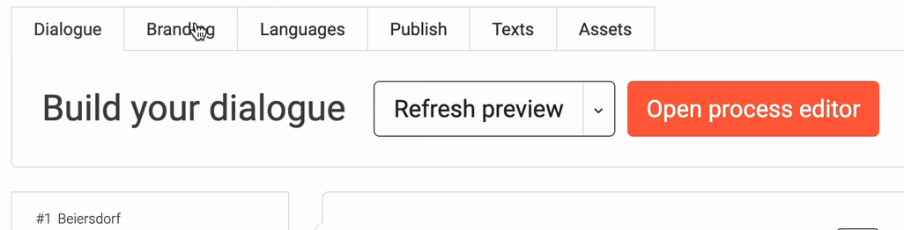

# Experiences 🚀
#### In this section we describe all the ways to edit your experience  
   

#### Here you can find the chapter with more detailed descriptions of the individual tabs  

| Start your experience              |Dialogue      |Branding|Languages|Publish                |Text & Assets|
|------------------------------------|--------------|--------|---------|-----------------------|-------------|
|[Templates](https://learn.loyjoy.com/experiences/templates/templates.md) [Experiences & Folder](/experiences/experiences/experiences.md) [Home views](https://learn.loyjoy.com/experiences/homeview/homeview.md) |[Process editor](https://learn.loyjoy.com/experiences/building/build_a_conversational_experience.md) [Module list](https://learn.loyjoy.com/experiences/modules/list/module_list.md) [Variables & Conditions](https://learn.loyjoy.com/experiences/variables/variables.md) [Functions](https://learn.loyjoy.com/experiences/functions/functions.md) [Best practices](https://learn.loyjoy.com/experiences/best_practices/conversation_design.md)|[Branding](https://learn.loyjoy.com/experiences/branding/branding.md)|[Languages](https://learn.loyjoy.com/experiences/language/language.md)|[Publish to Web](https://learn.loyjoy.com/experiences/publish/publish/publish.md) [Publish to Social Media](https://learn.loyjoy.comhttps://learn.loyjoy.com/experiences/publish/publish/publish.md#social-media) [JavaScript API](https://learn.loyjoy.com/experiences/publish/javascript_api/javascript_api.md)|[Texts and assets](experiences/text/text_and_assets.md)|
