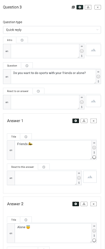
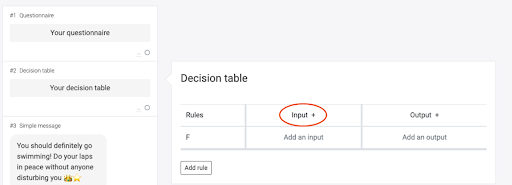
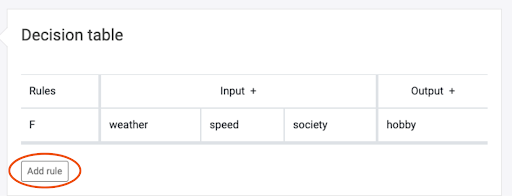
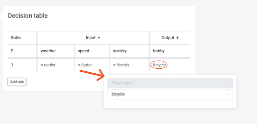

# Decision table

Building a product finder, a skin type test, or something similar has never been easier than with our decision table! You do not have to add every condition to each module. It is much simpler!
For this article, you should know how variables work. If you need help with that, read [this](/experiences/variables/variables.md) article first.
To use a decision table you need a questionnaire, a decision table, and some outputs. Outputs can be every module you want. The outputs are what the customer will see as a result. In this example, we will build a test on which hobby is best suited for the customer. As a result (outputs) we have swimming, cycling, and jogging.

### Add a questionnaire

First, you add the questions you want to ask. Add at least two questions. For fewer questions, it does not make sense to use a decision table.

Then choose the process variables and values for each question and each answer. Pay attention to the correct spelling!

### Working with the decision table

Now you open the decision table. We need to add as many inputs as you have added questions. Therefore click on *“Input +”*.

Afterwards, add an output by clicking on *“Output +”*.

Next, click on the first field under “Input” and select “process variable”. Fill in the name of the process variable of your first question. In the other field under input, you do the same with the other process variables.

Then, click on the field under “Output”, choose “process variable” again, and add a new name. Do not use a name that you have already used. For example, use “skin type” if you are doing a skin type test or use “product” if you are building a product finder. Select 'process specific' for 'Variable scope' if you want the variable to be used only in this experience and 'process independent' if you want the variable to be usable in other experiences as well.

As a next step, add a new rule.

With this, you determine the combinations of your questionnaire. For example, if you have three outputs: jogging, cycling, and swimming, add a rule for every
combination after which jogging comes as an output. Because of length, we are showing you how to do it with three combinations. After that, the system will be clear and you can choose more combinations! If the first combination is clicked by the customer the hobby will be cycling. So we add in the fields of the first rule values that fit. The system is similar to the variables at modules. Click on the field under the first input. Choose an operator and add the fitting value. This has to be the value that was
set in the first question.

Then you add the values in the other fields of your inputs too.

Next, you fill in the “Output”. For this, click on the field under hobby. Choose a fixed value and add a name that is fitting. In our case, we will use swimming, jogging, and bicycle.

Now the first rule is ready. If this combination is clicked, the customer will get “bicycle” as a result. You need to rule every possibility because otherwise the chatbot does not know what to send. In that case, there would be no output.

### Choose your modules

As the last step, you need to condition your modules. To condition them, click on the small circle of the module.

Then choose “hobby” as a process variable in the first field and your output (swimming, jogging, or cycling) as a fixed value in the third field.

That's it! Now your chat is customized to the customer's responses.

