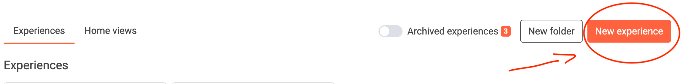
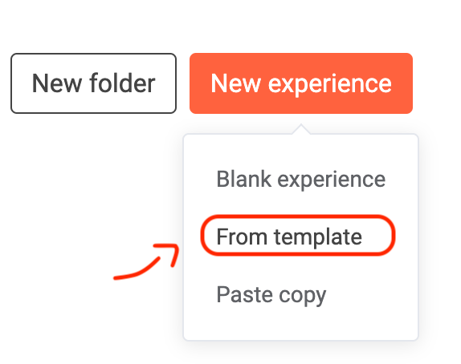
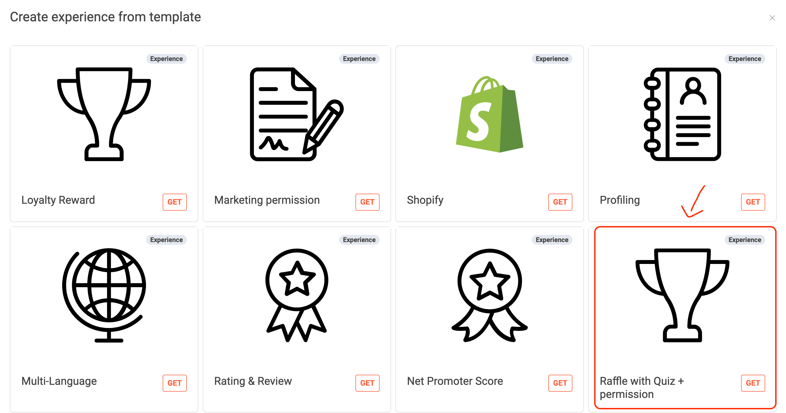
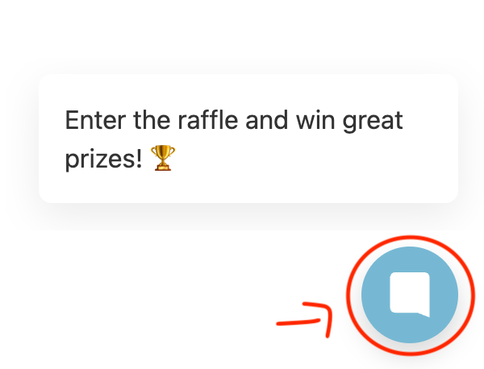
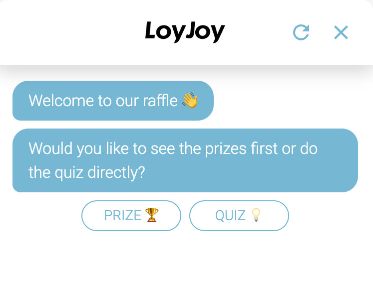

# Templates

With LoyJoy you can choose whether you want to create your own experience from scratch or use one of many templates we already created for you! 
When you want to use our ready-made experiences (e.g. giveaway or advent calendar) in the experiences tab, you simply can click on New experience.

  <b>Now you have the following options: </b>  
 Blank experience: Start from scratch with your own experience  
 From template: Use one of our awesome templates!  
 Paste copy: Paste an already created experience from your dashboard  

In this case we choose From template and get to the following window where you can create a new experience from a template. 

 The following image shows just a few of the many templates waiting for you to try out! 
We now choose raffles + quiz for this example. You can click on the blue bubble to get directly to the experience. 

And that's all! Here is your new experience to try. And of course, whenever you are ready you can modify it to your own preferences etc.

