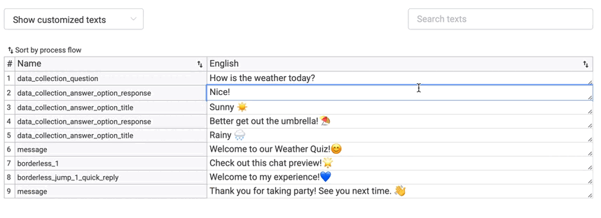
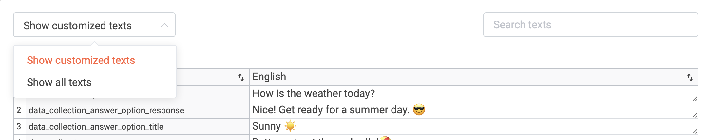
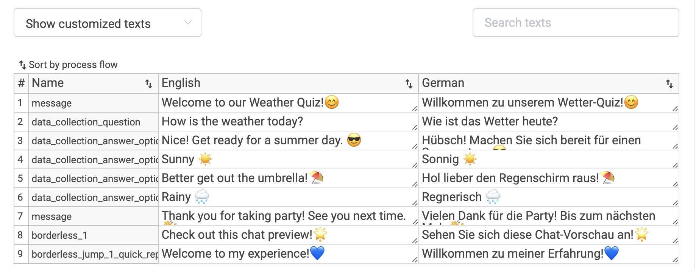

# Texts 

Manage all your Texts in one place - On the Texts tab, all text fields are available in aggregated form. Double-check your wording or have a copywriter edit right on the platform. Use the *'Search texts'* input field to quickly find what you are looking for!

You can search for individual texts and distinguish between customised or all texts. Customised texts display every text that you have altered in your experience while all text include the standardised text we have put in before for a smooth chat flow. 

If you offer your experience in more than one language, you are also able to quickly double-check all languages.

Under the Texts tab you are also able to download the CSV export of your Texts.

# Assets 

Under the *Assets* tab in your experience you can find  an overview of all the used images and videos with their file size. We recommend your pictures and videos be no larger than **500 kb** each to ensure a smooth loading process. So make sure to compress your assets to create the best customer experience for your clients! Try out [this Tool](https://compresspng.com) to compress your assets. 

