# Variables

Do you want to specify that modules will be sent only when certain messages will be chosen in a questionnaire? You can do this with variables!
Therefore, you need the module questionnaire or variable. In this article, we will first use the questionnaire. 

### Prepare the questionnaire

Let´s work with the following example: During the chat, the consumer will be asked whether he likes jogging or riding a bicycle. 
A message should then be sent with tips for suitable clothing for the chosen hobby. If you would only drag and drop the modules, 
all of them would be sent. To implement our plan you now use variables. With those, you can set what happens if the consumers click on one of 
those hobby messages.

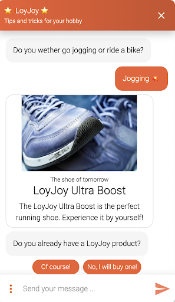

To do so, first, click on the settings icon.

  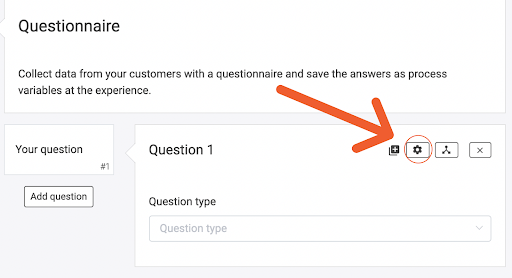

Afterward, choose a process variable. A meaningful name is suitable here. Our example is about hobbies. That is why the name "hobby" is appropriate.

  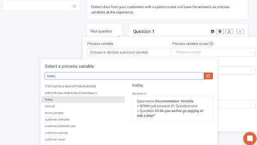

Then you click on the settings icons for both answer options too. 

  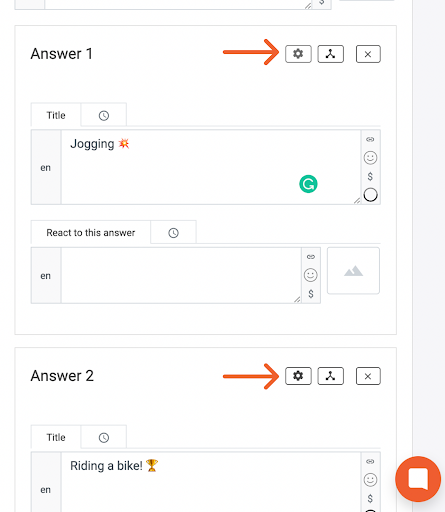

Here we set a fixed value and not a process variable. Because of transparency, we choose “jogging” and “bicycle”. 

  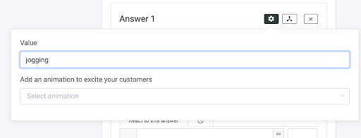
  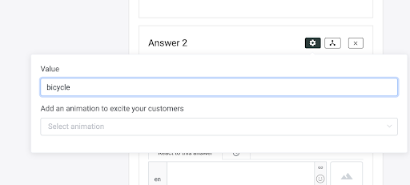

### Add variables to modules
Those names are freely selectable. Now we have chosen our variables. As a next step, you choose modules that will be sent after the consumer's decision.
The following step works with every module. At each module, there is a small circle in the right corner. 

  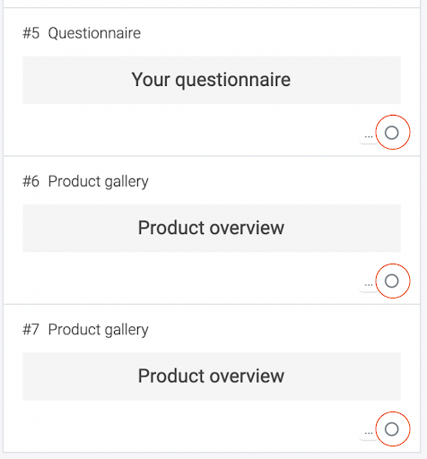

Click on it. Afterward, choose “add condition” and fill in the three fields. For this, you need to remember the given names in the questionnaire.

  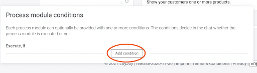

For the first field choose “process variable”. Fill in the given name for the question. In our example, it was a “hobby”. 

  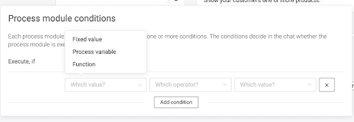
  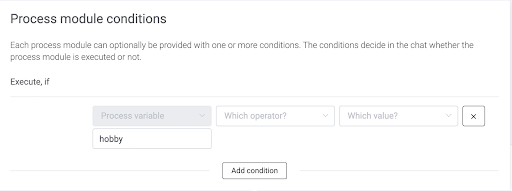

When setting a variable it is important to pay attention to spelling. The best is, to capitalize or lowercase all initial letters. Also, avoid the space 
behind your variables. As soon as it is a little different for the chatbot it seems like those are different variables. So take your time, because this 
can save you a lot of time later!
Next, an operator must be chosen. In our case we use “is equal”.

  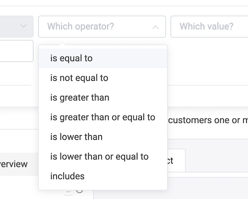

For the last field, you have to select “fixed value”.

  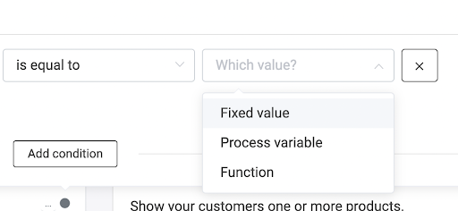

In this field, enter what was previously entered for one of the answer choices. If this module has a message for consumers who have chosen “riding bicycle” you enter in the last field “bicycle” and the other way round. The same thing you do for the second module. 

  
  

If you have more than two answer options you can add more modules as well. Besides, it is possible to condition more than one module for 
the same answer. 
For example, you want to give an interview and tips for the best practice to your consumer, and afterward, he can subscribe to a matching newsletter. 
Just drag and drop all those modules in a row and condition them with the same variable.

### Add more conditions

Besides, a module can have more than one condition for when it is played. To do this, you add another condition.

  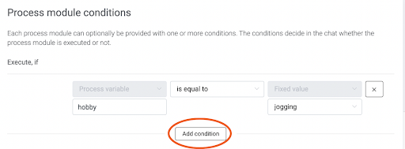

Here you can choose whether both conditions must be fulfilled (and) or only one of the two (or). 

  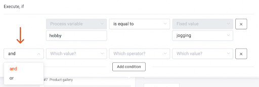

For example, if there were another answer option where the jogging tips should also be played, you would choose "or".

  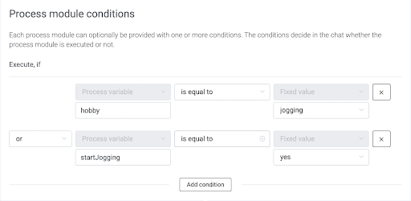

If we add a second question instead, where the user has to click on a certain answer for the module to be played, “and” would be suitable.
For example, after the consumer has selected "riding a bicycle", he is also asked whether he wants to ride an ergometer or ride in the fresh air. For 
the rider in the fresh air, there is a product recommendation for sunscreen, and for the rider at home, a recommendation for different series to watch 
on the bike. Here, too, any number of conditions can be added. 

As soon as more than one condition is necessary, however, you should consider whether a decision table is easier to handle.
For more information, please read our article.

### Module: Variable

At the beginning of this article, we mentioned that variables can be set with two modules. Now you know how it works with the questionnaire. Next, you learn how to use the module “variable”. It is not that different from the questionnaire. For example, there are different combinations in which the consumer will be asked if he wants to sign up for the newsletter. So that he is not annoyed, we add a variable to save the answer. Therefore you need a variable. 

  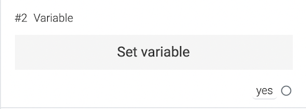

In case you have a decision jump that is asking for signing up, there are the options “yes” and “no”. Both will jump to a module “variable” (two different). 

  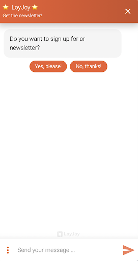
  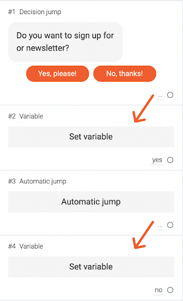

The first module is for “yes” and the second one for “no”. We need an automatic jump because else the second module “variable” will be sent too and the chatbot will save both variables. The brick jumps to the newsletter sign up.

  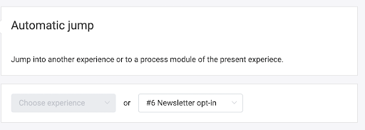

 Then you fill in the fields. It is similar to the questionnaire. We need a process variable and a fixed value. Under the first arrow, you fill in a name for the process variable (for example newsletter). Under the second arrow, you choose a fixed value and add a name. It is advisable to use “newsletter” as the process variable and “yes” (or “no” for the other module).

  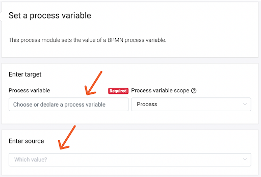
  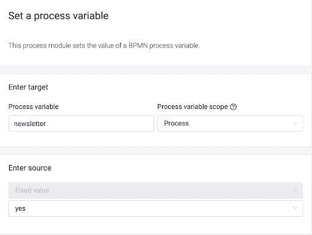

Afterward, condition every newsletter module and question if the consumer wants to sign up with the variable you set in when the consumer says “yes”. 

  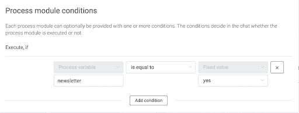

You can use variables in any different cases. Both were only examples to show you how it works!
