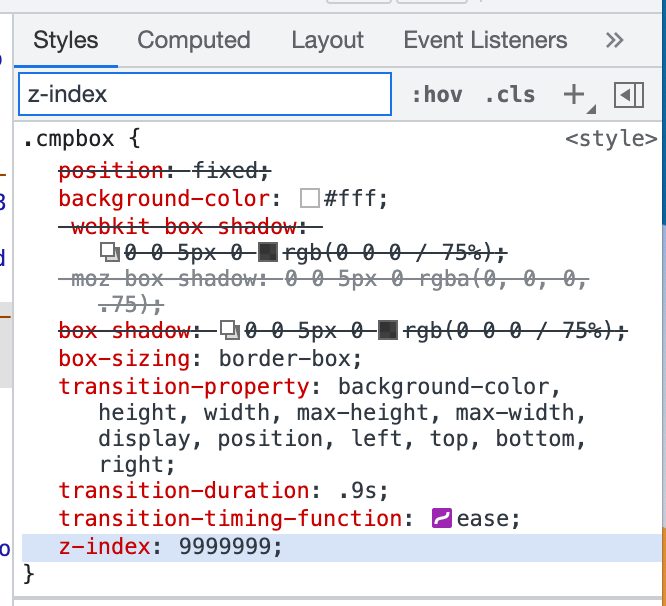
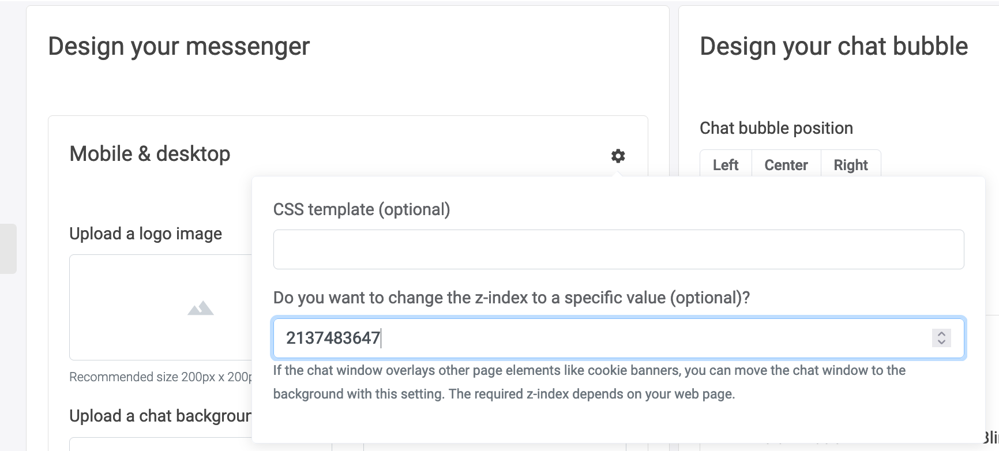

# How to prevent LoyJoy from drawing over elements on your website

## 1. What this solution will do for you

LoyJoy positions itself right on the top layer of your website to ensure that
no website element will draw over LoyJoy and prevent the chat from working.

However, some websites have elements that are obligatory. One such element is
a cookie consent popup. This guide will show you how you can tell LoyJoy to
position itself behind specific elements of your website.

## 2. What you need for this solution to work

First, you need to determine the z-index of the element you want to sit above LoyJoy.

To do this, you simply open up your website in a web browser. You wait for the
popup to appear (use private mode if necessary), right click on it and select
"Inspect". In the appearing inspector, you select the outermost element that
still belongs to the popup. In the style section of the inspector, you then
search for `z-index`. The resulting number is the z-index that LoyJoy has can
not be above. In this example the z-index is `9999999`.





## 3. Changing the LoyJoy z-index (drawing 'height')

Having determined the popup z-index, we can determine the z-index for LoyJoy.
LoyJoy's standard z-index is `2147483647` (the maximum value). We need to set a
z-index value that is lower than the z-index of the popup.

For our example the z-index would be

```
9999999 - 100 = 9999899
```

You can enter this value in the corresponding field in the `Branding` tab in
the LoyJoy backend. Afterwards, your popup should lie above the LoyJoy
elements.




