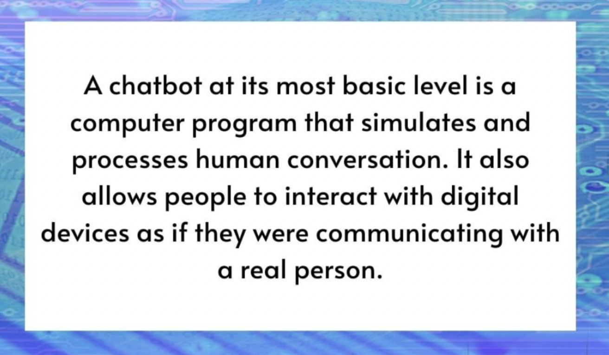
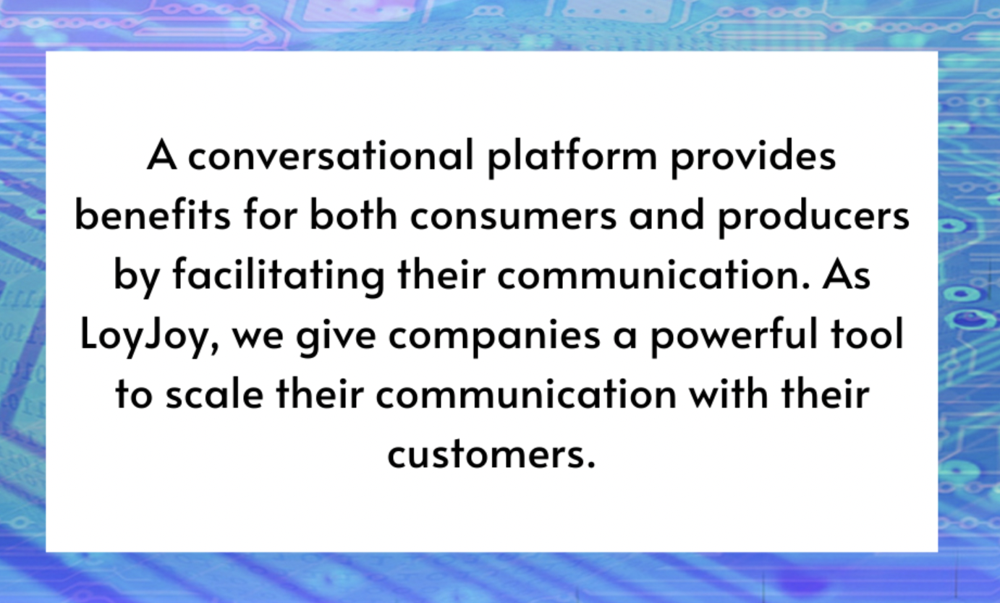

# What Is a Chatbot?

# What Is a Conversational Platform?

# What Is a BPMN Engine?

Let's start with the letters B-P-M-N. It stands for Business Process Modeling Notation. Basically, it's a way to turn a process into a diagram. A process such as a company's billing process. This diagram can then be used to better understand the process, communicate it, or automate it, and this is where an engine comes in. A process engine can take such a diagram or model and automatically walk through the steps.
