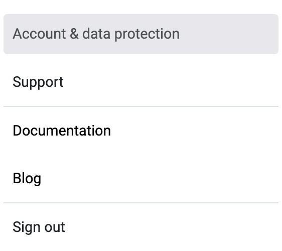
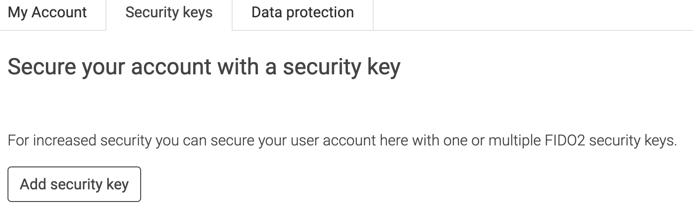

# Two-factor authentication 🔐

## What is 2FA?
2FA (Two-factor authentication) is an additional protection that ensures the security of online accounts beyond the username and password.
At LoyJoy we always look for ways to improve the security of accounts and data. We adopted new technology to get rid of passwords which are not only often forgotten, but the same credentials are often used for many accounts and are therefore insecure.

## 2FA in LoyJoy?
You can log in to LoyJoy using:

1. a magic link, which is sent to your mail address and is valid for 10 minutes 
2. a hardware key in accordance with the FIDO2 standard (recommended method)
3. a fingerprint sensor of your laptop 
4. an Android device via QR code 

## How to set-up 2FA in LoyJoy?

1️⃣ Click on your avatar in LoyJoy to get into the settings

2️⃣ Go to `Account & data protection`

3️⃣ In the new window, click on the tab `Security keys`

4️⃣ Then click on `Add security key`

5️⃣ Add your key in the form of hardware key (FIDO2), fingerprint sensor or Android device. 

We strongly recommend using a FIDO2 key, which can be bought as [USB + wireless NFC](https://www.mtrix.de/shop/security-key-nfc/) or [USB-only](https://www.mtrix.de/shop/security-key-fido2/). The LoyJoy team members as well as most LoyJoy customers use the [USB + wireless NFC](https://www.mtrix.de/shop/security-key-nfc/) version, which makes it easy to switch between your devices (computer, mobile phone), and can be used not only to secure your LoyJoy user account, but also all kinds of other [services](https://www.yubico.com/de/works-with-yubikey/catalog/?sort=popular) such as Google, AWS, Salesforce etc.
