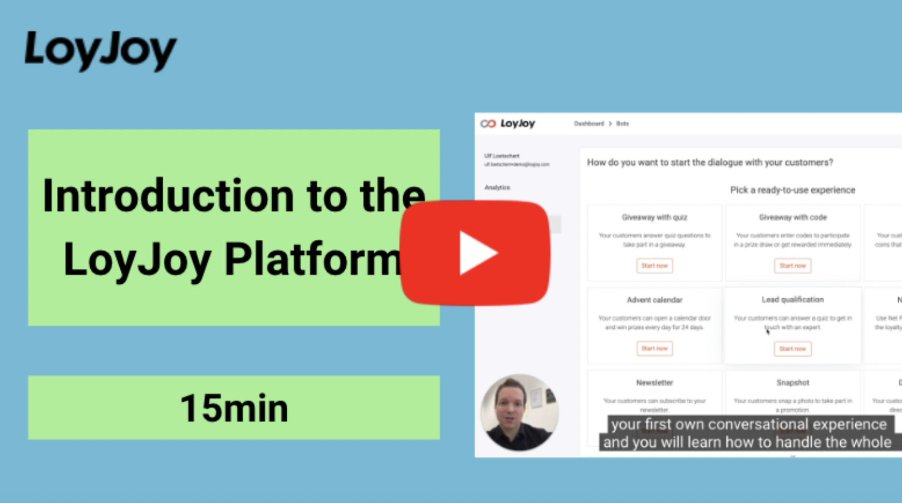
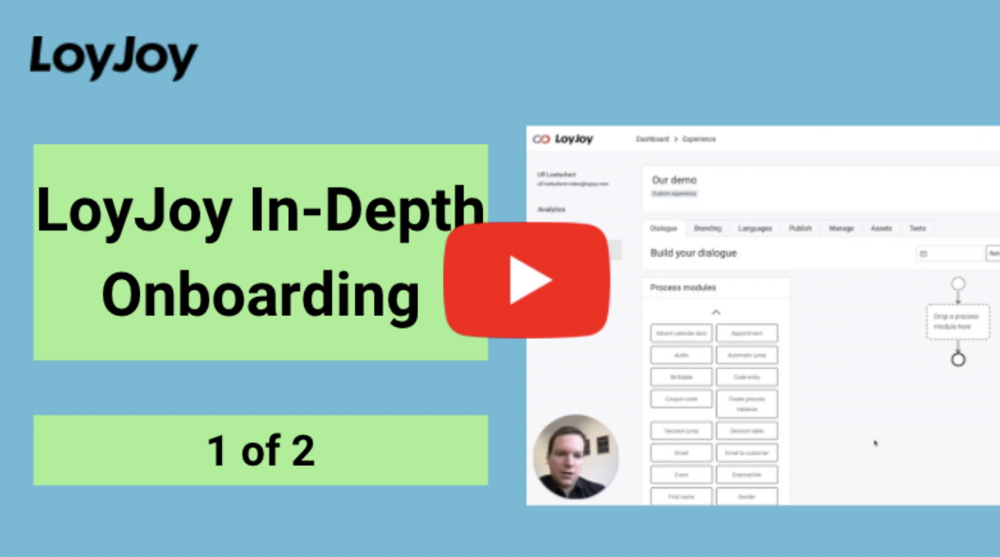
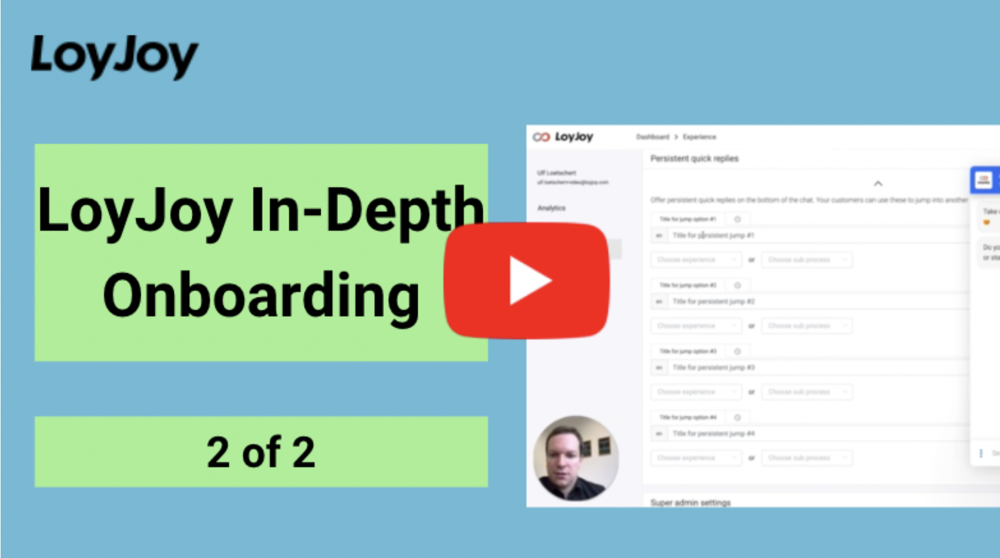

# Welcome to LoyJoy! 🎉

Turn your brand into a conversation in just a few steps.

## Getting started
💥  [Sign in](/getting_started/sign_in/sign_in.md) 
💥  [Two-factor authentication](/getting_started/2FA/2FA.md) 
💥  [Invite colleagues & assign roles](/getting_started/roles/roles.md) 
💥  [Personal settings](/getting_started/personal_settings/personal_settings.md)

## Watch our Onboarding Videos

Just click on the videos and see it works. Enjoy and build your own chatbot straight away 😎

Special hint: The onboarding videos have chapters- check out the description
and look for the chapters that are most relevant for you! 

## Book a Web Session
Some ideas but don’t know how to start?

Contact us now via sales@loyjoy.com or [book your demo session](https://calendly.com/loyjoy/demo/) with us where we can talk about your individual ideas and questions.

We hope that gets you started fast- enjoy.  

__Your LoyJoy Team 🚀__
