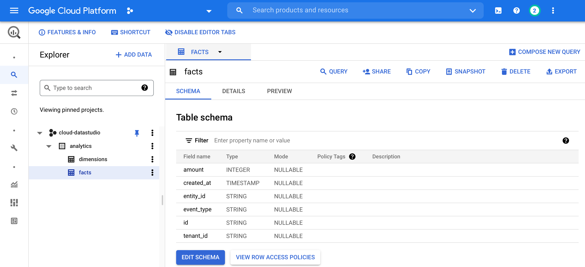
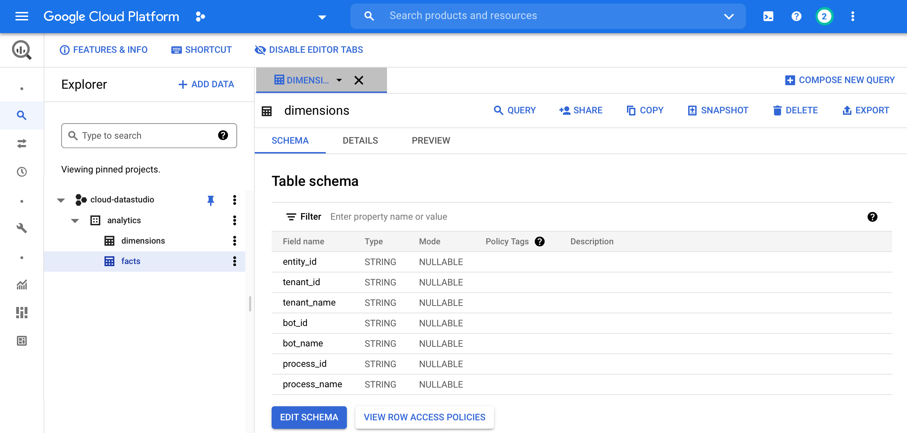

# How to write LoyJoy analytics to Google Cloud BigQuery

LoyJoy automatically provides an integrated Analytics dashboard for any chatbot
you create. You can find these dashboards in the manager under `Analytics`.

However, we offer to export all the underlying analytics events on a daily basis
to Google Cloud BigQuery as an external data warehouse. To achieve this the following
steps are necessary.


## Create tables in Google Cloud BigQuery

Open Google Cloud and create a Google Cloud Project.
Open Google Cloud BigQuery with this Google Cloud Project.

### Facts table

Create a table `facts` in your Google Cloud project with the following schema.





```
facts:
- amount (INT64)
- created_at (TIMESTAMP)
- entity_id (STRING)
- event_type (STRING)
- id (STRING)
- tenant_id (STRING)
```

### Dimensions table

Create a table `dimensions` in your Google Cloud project with the following schema.





```
dimensions:
- entity_id (STRING)
- tenant_id (STRING)
- tenant_name (STRING)
- bot_id (STRING)
- bot_name (STRING)
- process_id (STRING)
- process_name (STRING)
```


## Create a service account

Create a new service account in Google Cloud Platform under [service accounts](https://console.cloud.google.com/iam-admin/serviceaccounts) with privileges `BigQuery Job User`, `BigQuery Data Editor`.

Click `Keys` > `Add Key` > `Create new key` > `JSON` to create JSON credentials for this service account. Your Web browser will download a key file.


## Provide service account credentials to LoyJoy support

Please provide the credentials key file created by you to LoyJoy support. We will enter the credentials in the Google Cloud BigQuery connector of your LoyJoy tenant.

On a daily basis the Google Cloud BigQuery connector will copy all analytics events from LoyJoy to Google Cloud BigQuery.
