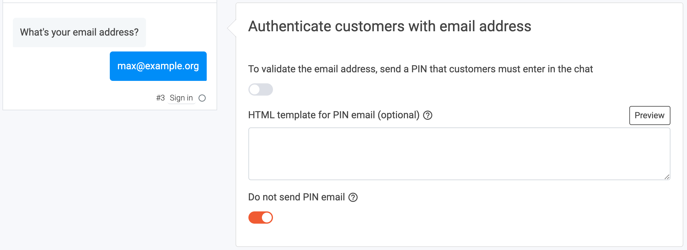
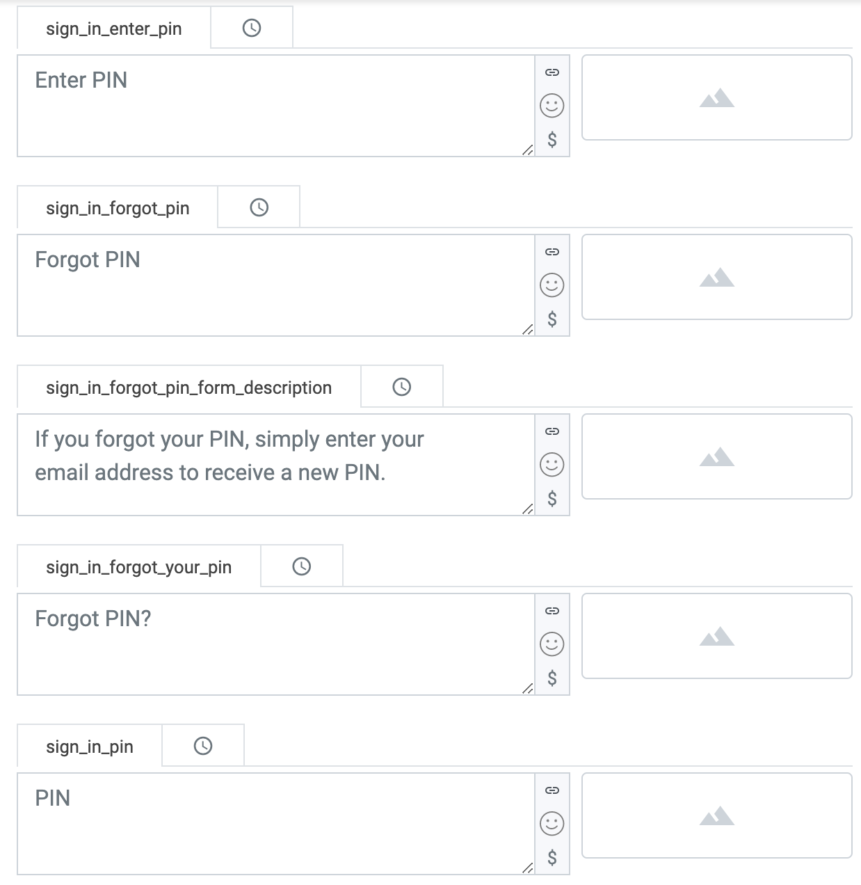
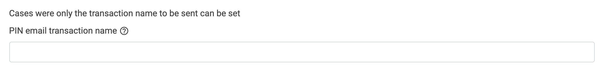

# How to send PIN emails from ProCampaign

## 1. What this solutions will do for you

Some of your chatbots aim to get customers to return again and again. Especially Loyalty experiences or an Advent Calendar are use cases where your customers ideally return. LoyJoy will remember the customer and can identify them without asking for an email address again. Occasionally a customer will return to the chatbot from another device or delete their browsing history. In this case, LoyJoy sends a 6-digit code (PIN) via email to customers, which has to be entered in the chat. This article describes **how to send PIN emails to your customers from ProCampaign**. LoyJoy will automatically transfer your PIN email details to ProCampaign.

## 2. What you need for this solution

To begin transferring the participants from LoyJoy to ProCampaign you will need two things - your ProCampaign admin will help you with this:

 - The **PIN email transaction name** in ProCampaign.
 - The **API key** that has the needed rights to send the transaction.

## 3. Add the Sign In process block to your chat flow

Create or copy a new experience and add the `Sign In` process block if your chatflow does not have one yet. The sign up process block collects the email adresses from your customers. For example, in a Loyalty chatbot, the `Loyalty Points` process block requires a `Sign in` to identify the customer and assign the points. When the individual customer returns to the chat from a different device, he can access his point account by typing in his email address and the 6-digit PIN from the PIN email, which will automatically be sent to him. 

Make sure to activate the `Do not send PIN email` button to deactive LoyJoys built-in PIN email service.

Scroll down to `Other texts` and if you wish edit the following fields. You can define the messages which will be displayed within the chat in certain cases. The text in the field `sign_in_enter_pin` will appear when a customer tries to sign in with the same email address again. He will then receive the PIN email by ProCampaign triggered by LoyJoy. You can keep the default texts here, if you like.

Now we configure our process block `ProCampaign` to transfer the data from LoyJoy to a corresponding transaction and data field in ProCampaign.

Awesome! :tada: You are one step closer to sending PIN emails from ProCampaign. One more step to go!

## 4. Configure the data transfer

You've completed all the configurations within the chat. Now you have to set up the data transfer.

On the LoyJoy platform, go to settings, then choose integration. Choose ProCampaign and click on "Add now".

This will add a new tab with the name "ProCampaign" below the cards.

Scroll down to "General settings".

Set a name for your integration (since you can have several integrations this will help you keeping an overview).

Enter **your API key** that you got from your ProCampaign admin.

Scroll down to the section `Cases were only the transaction name to be sent can be set`. Now fill in the **PIN email transaction name** into the according fields in LoyJoy. This will trigger the connected action in ProCampaign and send the requested PIN email to your customer.

Scroll down and activate the integration for your bot in the field "Choose on which bots the integration should be active". Click on "Add a mapping" to create a mapping for the email field. Then choose `process variable` and type in **customer_email** to refer to your data field in your chat flow. Now just type in the source name of the data field in ProCampaign **Email**.

Congratulations! You just have successfully connected your LoyJoy chatbot with ProCampaign and from now on all PIN emails will be automatically sent by ProCampaign. Good job! :tada:
