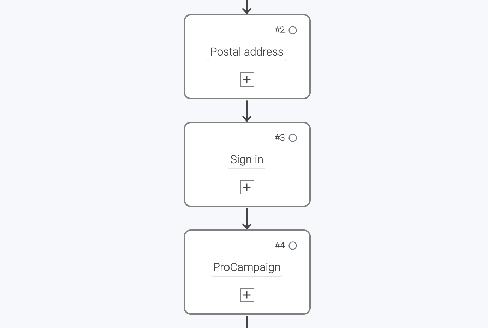
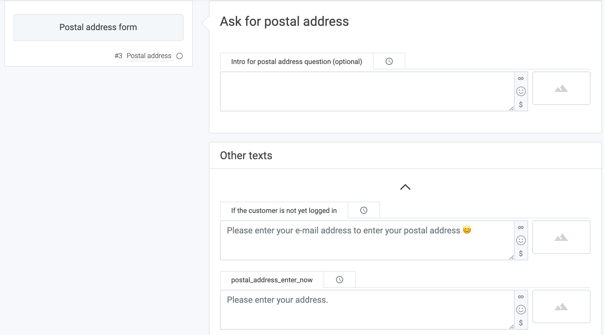
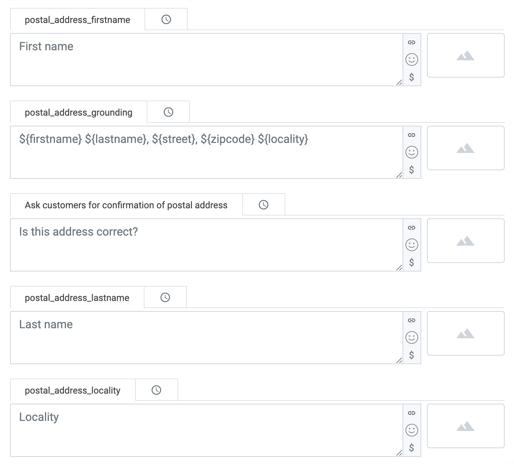
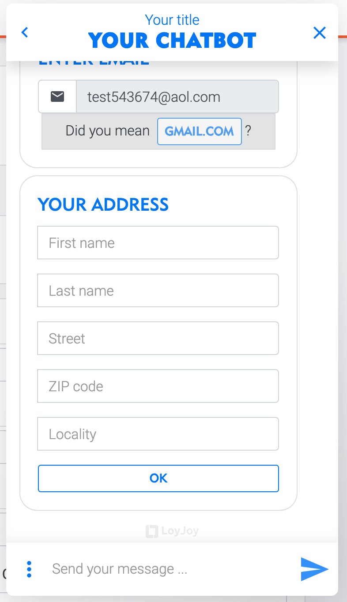
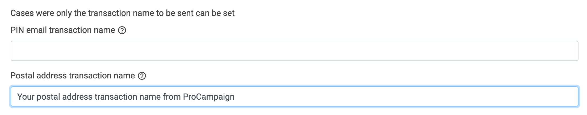
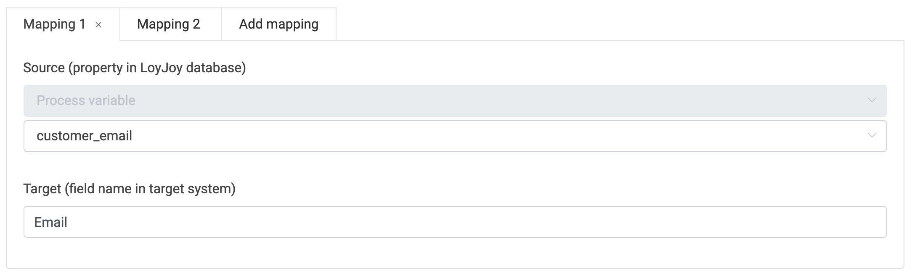

# How to transfer postal addresses from LoyJoy to ProCampaign

## 1. What this solutions will do for you

Some of your chat bots aim to collect address data from the customers. Potential use cases for collecting address data are raffles or any kind of giveaways. LoyJoy gives you the possibility to tranfer this data directly to your ProCampaign database. 

## 2. What you need for this solution

To start transfer the participants from LoyJoy to ProCampaign you will need two things - **your ProCampaign admin will help you** with this:

 - The **Postal address transaction name** in ProCampaign
 - The **API key** that has the needed rights to send the transaction

## 3. Add particular process block to your chat flow

Create or copy a new experience and add the **`Postal Address`** process block to your chat flow. Also add the **`Sign In`** process block if your chat flow does not already have it. The login process block collects your customers' email addresses as a registration for each customer. At last add the process block **`ProCampaign`**. This bundles your data and sends it to ProCampaign.

Close the process editor and go to the `Postal Address` process brick.

In `Other texts` you can edit the texts displayed in the chat. 

The following image shows the user interface of the `Postal Address` process block. You can edit the placeholders in `Other texts` in the editor.

Now we configure our process block `ProCampaign` to transfer the data from LoyJoy to a corresponding transaction and data field in ProCampaign.

Cool! :tada: You just created your postal address transfer in the LoyJoy chat. One more step to go!

## 4. Configure the data transfer

You've completed all the configurations within the chat. Now you have to set up the data transfer.

On the LoyJoy platform, go to settings, then choose integration. Choose ProCampaign and click on "Add now".

This will add a new tab with the name "ProCampaign" below the cards.

Scroll down to "General settings".

Set a name for your integration (since you can have several integrations this will help you keep an overview).
Enter **your API key** that you got from your ProCampaign admin.

  

Scroll down to the section 'Cases where only the transaction name to be sent can be set'. Now enter the **Postal address transaction name** in the corresponding fields in LoyJoy. This will trigger the associated action in ProCampaign.

Scroll down and activate the integration for your bot in the field "Choose on which bots the integration should be active". Click on "Add a mapping" to create a mapping for the email field. Then choose `process variable` and type in **customer_email** to refer to your data field in your chat flow. Now just type in the source name of the data field in ProCampaign **Email**.

Congratulations! You just have successfully connected your LoyJoy chatbot with ProCampaign and from now on all collected postal addresses within the LoyJoy chat will be automatically send to ProCampaign. Good job! :tada:
