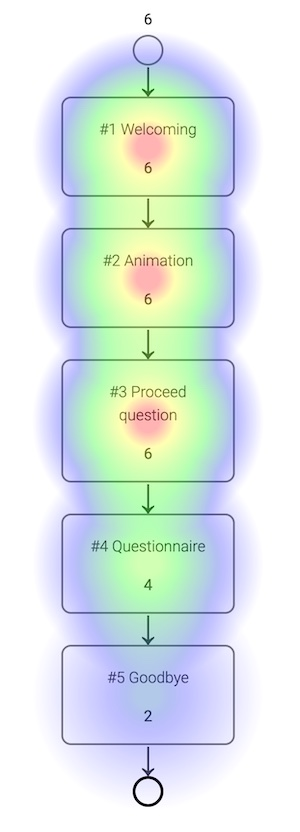

# Experience analytics

There are two tabs in this view: Overview & Drilldown. The overview tab shows the aggregated numbers and general charts for this experience. The drilldown tab shows the heatmap depicting which process modules were visited how often and allows you to click on each module to analyse module-specific data.

## Overview

This tab shows general KPIs of your chat experience.

Major KPIs are:

**Screen time** - The cumulated screen time that all your customers have spend in the chat.   
**Sessions** - The number of users that received chat messages. Users returning after more than 30 minutes are counted again. Inside these 30 minutes, each user will only have one session, no matter how many experiences they visit.   
**Sessions with conversation** - The number of sessions during which users have send a chat message or clicked a button.   
**Bounces** - The number of sessions minus the number of sessions without interactions.  
**Chat Starts** - The number of times the experience was started. There can be more than one chat start per session.

If you scroll down, you will see the above-mentioned KPIs displayed as a graph to show you the performance over time.

## Drilldown

The drilldown tab allows to you analyse the performance of each module in detail. First, it shows an overview of all modules in the process with an overlayed heatmap. The heatmap shows how often modules were visited by users from blue over green and yellow to red ascending from rare to often. Additionally, the exact number of module visits is shown for each module.

Clicking on one of the modules allows you to explore its data in more detail. Depending on the module, it will display specific data such as number of opt-ins or frequencies of answers in questionnaires.

## Date selection

A menu right above the drilldown and overview tabs allows you to select a specific date range you want to analyse. You can select one of the predefined date range or simply select a start and an end date.

The view will update and display the data for the selected date range. The selection will affect all tabs and views.

## FAQ

### What is the difference between chat starts and sessions?

A chat start is counted each time a user starts an experience. A session starts
when a user receives messages for the first time *inside 30 minutes*.

Let us imagine you have two experience: `A` and `B`. All users start in experience
`A` to be welcomed and can then choose to proceed to experience `B`. If a user
visits both experiences they will create two chat starts, one in experience `A`
and one in experience `B`. However, only in experience `A` there will be a
session recorded.

### Why are there no / few new sessions in my experience even though it was started?

A session is only started in the first experience a user has visited. Because of
this you have to look for the new sessions in the start experience or look at the
analytics of a folder (you can also create a new folder to do this).

### How are bounces calculated?

Bounces are defined as sessions without interactions. Consequently they are
calculated by subtracting the number of sessions with conversation from the
number of sessions overall.

### Do I have to many bounces in my experiences?

The fraction of bounces that can be expected can differ greatly between
experiences. Experiences that open automatically, for example, are expected
to have a higher bounce rate as the users do not actively choose to open the
chat. Also social media campaigns can differ greatly in their conversion rates.

Still, there are some steps that can help reduce the bounce ratio / increase the
conversion rate:
- Do give the user a meaningful choice as the first step of the experience. The
  most basic example would be "Do you want to see the prices or go straight to
  the quiz?"
- Do *not* send the user too many text messages without breaks in between. We
  recommend no more that two text messages between user interactions. Also try
  to keep text messages as short as possible - chat style
- Do increase user engagement by using many graphics, especially animated ones

### How can I find out where my users bounce in the experience?

For this purpose we have created the drilldown tab. Here you can see all the
modules of your experience and see how often each one of them was visited:

 

Here we can see that the process was started 6 times (number above the top
circle). Accordingly, each of the first 3 modules was seen six times. The
proceed question is the first stop / break in the process where the chat waits
for user input. We can see that the Questionnaire `#4` was seen 4 times. That
means that 4 chat users have confirmed the proceed question. Furthermore, we
can see that the Goodbye `#5` was seen two times. That means that two times
users have answered the questions in the questionnaire and proceeded to the
final Goodbye step in the process.

### What does the drilldown tab show?

The drilldown tab shows a sequential view of the different modules that make
up an experience. For each of the modules it shows the number of times this
module was shown. Laid over the the modules is a heatmap that visually indicates
the relative frequency (blue over green and yellow to red from low to high).

You can get more details about each of the modules simply by clicking on it.

### Why does my second module have more views than the first one?

This can have two causes:
- The first module was added after the chat went live
- The first module has a condition that means that it will not be shown to all
  users
