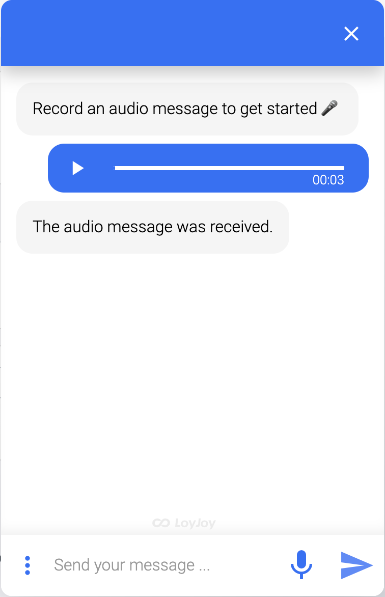
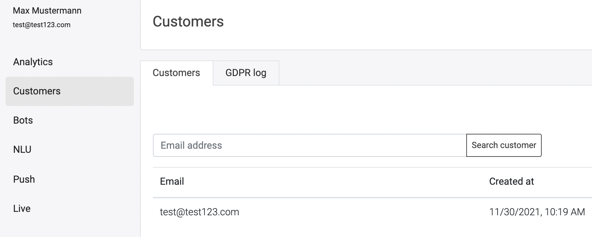
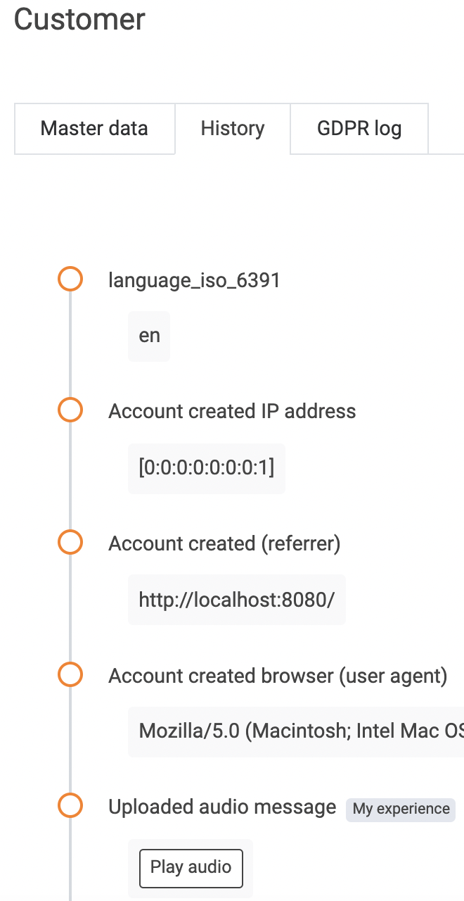

## Audio recording

Your customers can send audio messages to your chatbot.

**Sign in** - If the customer is authenticated via sign-in module you can find it like shown below (Location).
In any case the audio message can be dowloaded via LoyJoy API.

**Location** - You can find the audio message under the customers menue.

Click on the customer and go to the history tab.

