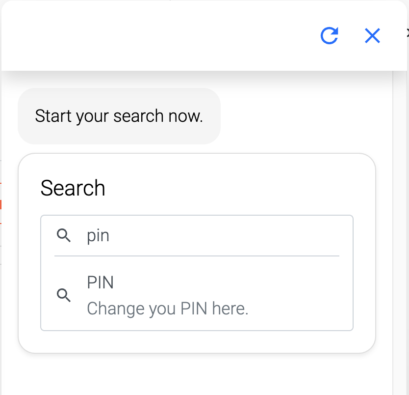

## Search
Let your customers search for texts in all experiences. With a click, your customer can jump into the selected experience. To make experiences availabe in search, a title and description are required, which can be modified under meta information of the process.

**Language** - The Search uses the current language you are using at the moment. If you want to let your customer choose another language by himself, you can use the language selection module.
