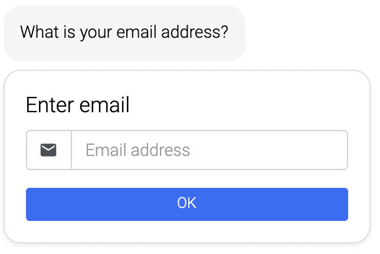

## Email

Ask your customers for their email address.

The email is stored in the "email" variable. You can reuse the value of this variable in texts by using the following expression: "${email}".

**Ask again for value** - If the variable "email" already has a value, you can ask the customer again by enabling this option.

**Terms** - You can add terms that the customer has to accept.

While "Do your customers have to agree to terms?" is activated, customers have to accept the terms to enter their email.

You can store the terms intern as html file or link to a website.
