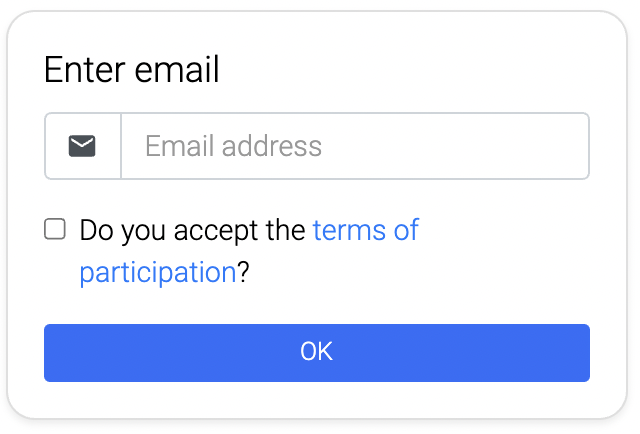

## External link

Direct your customers to an external website with a link.

### Link
**Link URL** - Add here the URL for the external link. You can decide if you want to open the website in a new tab or inside the Chat (WebView).

If you choose the WebView you have to consider the following. The linked website must not prohibit the integration in an IFrame via X-Frame-Options, else the connection will be denied by the Web browser.

**WebView example** -  You can activate this option by clicking the settings icon next to the "Link" heading.

**Trigger event** - You have the chance to trigger an event when the customer clicks on the link. The event is (1) emitted via LoyJoy JavaScript API, (2) stored in the LoyJoyAnalytics database, AND (3) triggers signal process modules that wait for the event name.
You can read about all the events and their function [here](/tracking_integration/google_tag_manager/google_tag_manager.md).

You can edit the trigger event using the settings icon next to the Link heading.
### Appearance
**Embed link content in chat if possible** - Things like YouTube Videos or similar can be shown directly in the chat. When the link content is embedded in the chat, the title and description are no longer displayed.

**Title** - Add a title that will be shown under the link.
**Description** - Add a description that will be shown under the link.

**Alternative to image upload** - An alternative to the usual image upload is to add a process variable in which the URL of the image is stored. This image is then displayed as a new link image.
