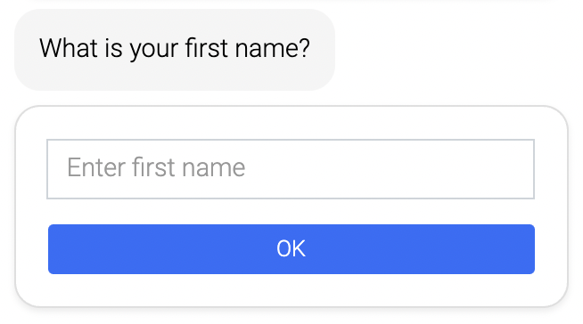

## First name

Ask your customer for their first name.

**Storage** - If you want to store this information in association with your customer, you must have a sign-in module somewhere before the first name module. If you are not using the sign-in module, you can still use this information in the conversation by using the "firstname" variable with the following syntax: ${firstname}

**Ask again for value** - If this option is enabled, the customer will be asked again about their first name, even if they have already answered the question.

**Other texts** - Here you can add an intro and a message which will be sent after the consumer input.

**Database** - Your customer database has to be activated by LoyJoy to use all the Sign-in functions.
