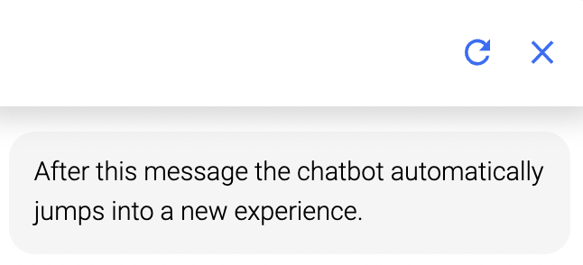

## Automatic jump

Jump into another process step or into a different experience, use this to create whole customer journeys.

**Choose experience** - Jump into another chatbot experience to connect different experiences.
**Choose sub process** - Jump to process brick in this experience.

**Jumping** - Jumping between experiences/processes does not discard any given information or local variables. The flow behaves like one experience. You can not jump into a different bot (just experiences and sub processes).

**Usecase** - Most times it is used with a condition at the module.

**Open new view** - If you jump between experiences, you can choose to open the new experience in a new view.

-> new view:

