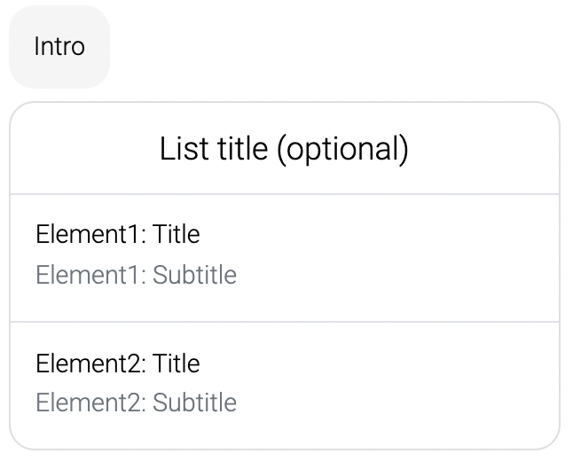
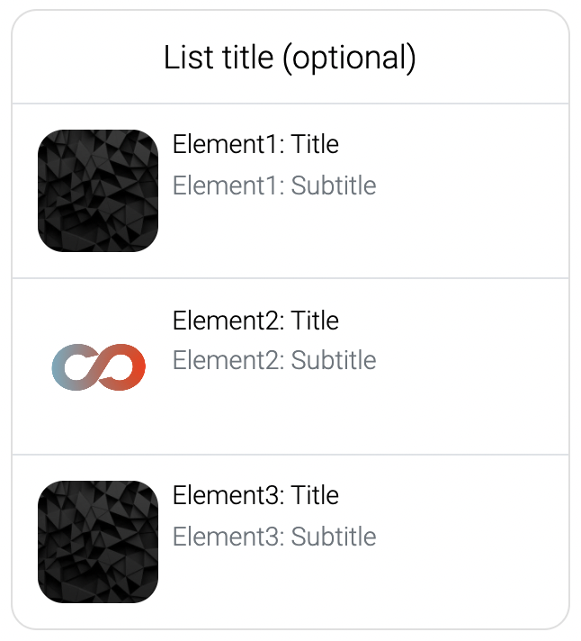
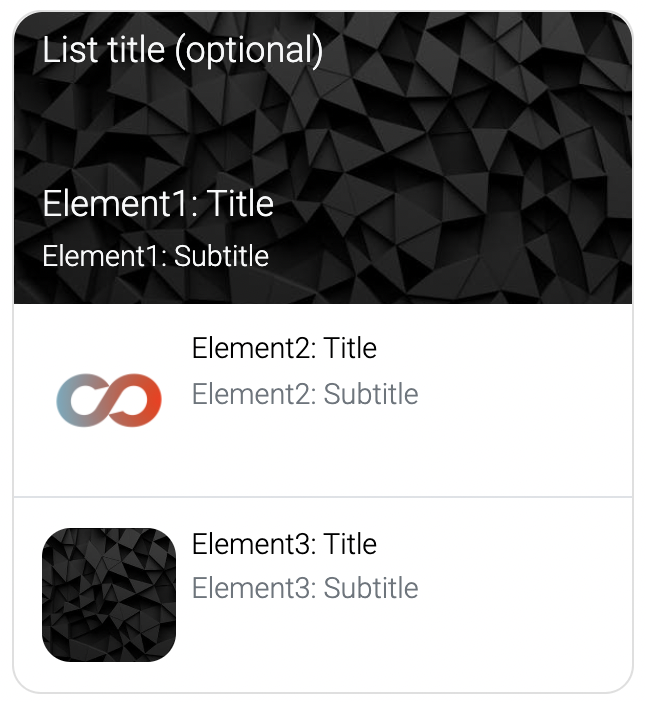

## List

Display a list in the chat.

**Buttons** - You can add buttons to each list element as well as add a button to the whole list. If the list contains any buttons, *this process module waits for user input*! When pressing one of these buttons, there can be 2 effects, namely (1) that a reaction text can be sent and (2) that a variable value can be set. (1) The reaction text can be set for the list button and each list element separately. (2) The variable key for the variable to be set can be configured on the list. The variable value can be configured on the list and each list element. A usual pattern is to set a variable `selected_list_element` with a value `list`, `list_element_1`, `list_element_2` and so on, and to use that variable `selected_list_element` in later process modules of the experience, e.g. in [BPMN process conditions](https://learn.loyjoy.com/experiences/variables/variables.md).

**Jumps** - You can configure that each list element should jump to a different experience or process module. This is achieved by selecting a jump target for the list element.

**Conditions** - You can configure for each list element individually that it should only be shown to the customer, if a specific condition in met.

### Styles

**Style "Compact"** - This is the default style and looks like this:

**Style "Large"** - This style uses the first element as the top element and displays it differently. The font color will be white, so you need to make sure you use a dark image for the first element.

