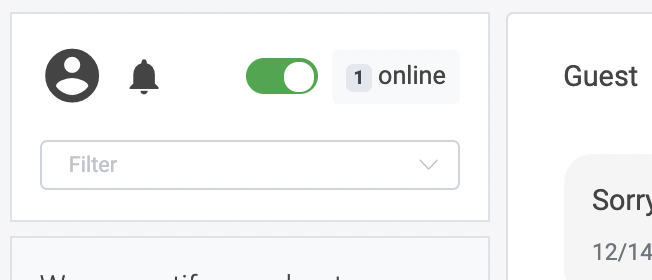

## Live chat

Give customers the option to chat live with your users in the chat. As soon as a customer enters this process module, the conversation is marked as "waiting" in the "Live" menu entry and an agent can take over the chat.

**Waiting time in seconds for agents to respond** - Here you can edit the amount of time, the agents got to answer.

### If no agent is available

**Exit** - returns to chatflow and goes into the next process.
**Jump** - choose your jump target where you want to send your customer if no agent is available.
**Asynchronous response** - Give your customer the option to have you contact them via email.

### Agents

Agents have to go to Live and mark themselves as online to interact with users live. They can only interact with users who are currently in the Live module.

->

