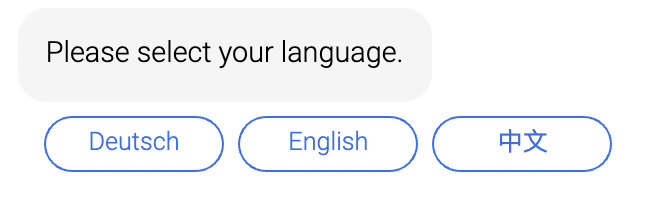
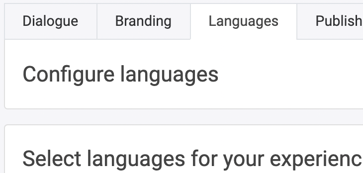

## Locale

If multiple languages are available in the chatbot, customers can choose which language they prefer.

Make sure you add the languages in the "Languages" tab in your experience area. You can either edit the texts in the modules or copy/translate them all in one at the bottom of the "Languages" tab.

