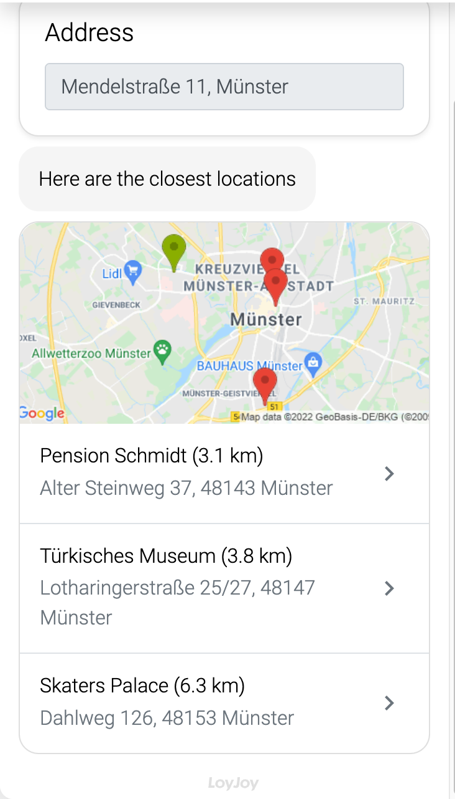

## Places

Let the user enter an address and calculate the distances to a set of destinations. The closest 4 destinations are shown as a list. Using addresses solely will always result in the point being snapped to the road nearest to those addresses instead of the location itself. As this process module integrates Google Maps, several API keys are mandatory. Furthermore, if you provide more than 25 different destinations, the latitude and longitude of each destination is required.

### Acquire Google API keys
1. Make sure you enabled Places API, Distance Matrix API, Geocoding API and Maps Static API in your [Google Cloud Console](https://console.cloud.google.com/google/maps-apis/api-list)
2. Create a new key in your [Credentials Area in Google Cloud Console](https://console.cloud.google.com/apis/credentials). Name this key "Places Server Key" and set the Application Restriction to "IP addresses (web servers, cron jobs, etc.)". Moreover, restrict the key to Places API, Distance Matrix API and Geocoding API.
3. Create a new key in your [Credentials Area in Google Cloud Console](https://console.cloud.google.com/apis/credentials). Name this key "Places Browser Key" and set the Application Restriction to "HTTP referrers (web sites)". Moreover, restrict the key to Maps Static API.
4. Copy the generated keys to the respective fields in LoyJoy's Places Module.

### Connectors
You are further able to connect your Google Sheets Data with LoyJoy through connectors. 

1. Make sure you enabled Google Sheets API in your [Google Cloud Console](https://console.cloud.google.com/apis/dashboard)
2. Create a new key in your [Credentials Area in Google Cloud Console](https://console.cloud.google.com/apis/credentials). Name this key "Google sheets API" and set the Application Restriction to "IP addresses (web servers, cron jobs, etc.)". Moreover, restrict the key to Sheets API.
3. After creating a LoyJoy Connector, paste to the generated key into the connector under it respective field.
4. Identify your Spreadsheet ID which can be observed in the URL of your sheet. Also provide a sheet name in LoyJoy.
5. Allow access from your google service account to you Google Sheets API. However, it is recommended to simply publish your sheet.
