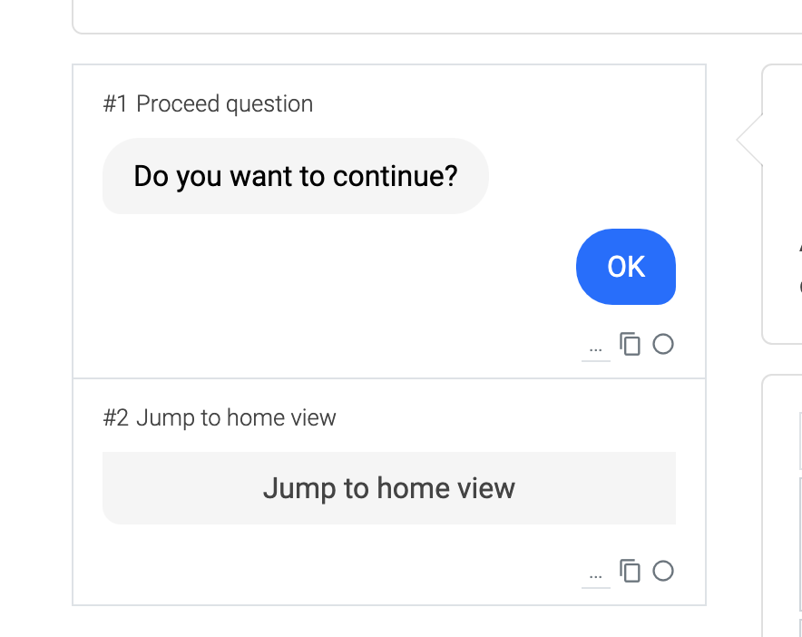

## Jump to home view

If a home view is configured this process module jumps to it. The jump is executed directly when the process is opened. To prevent this, place a decision jump or a continuation question before the jump.

