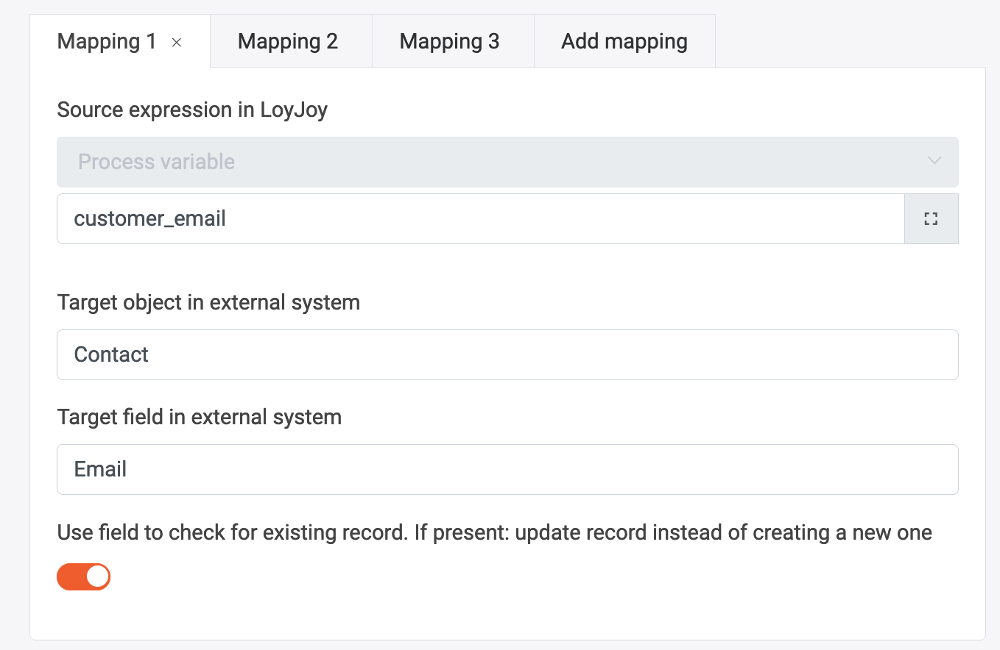
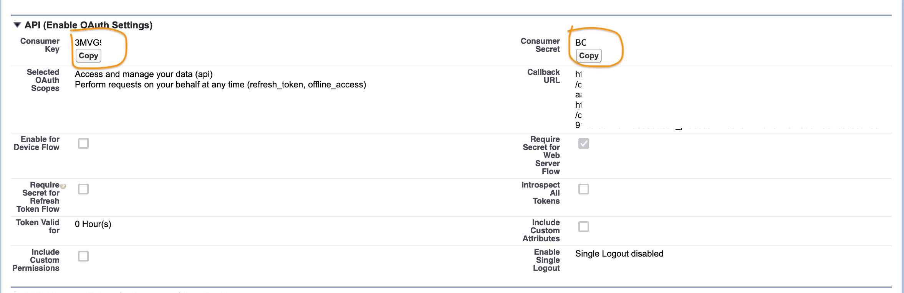
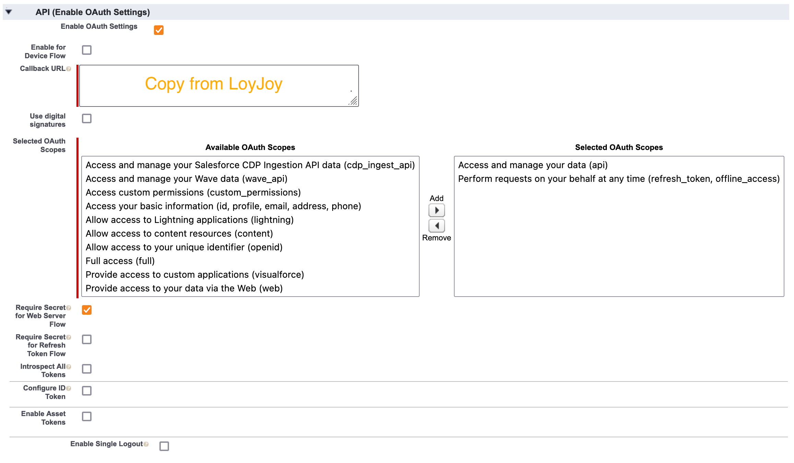
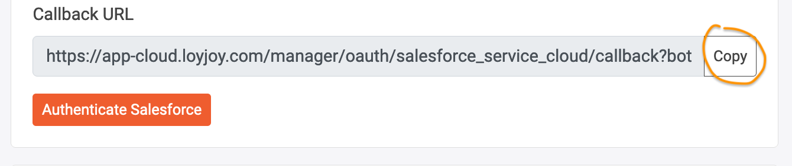
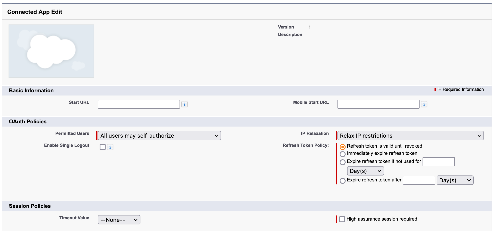
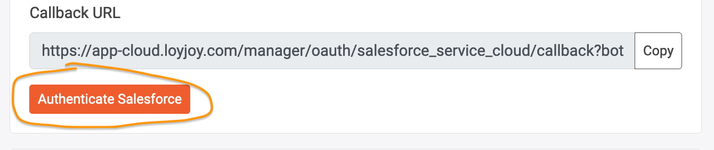
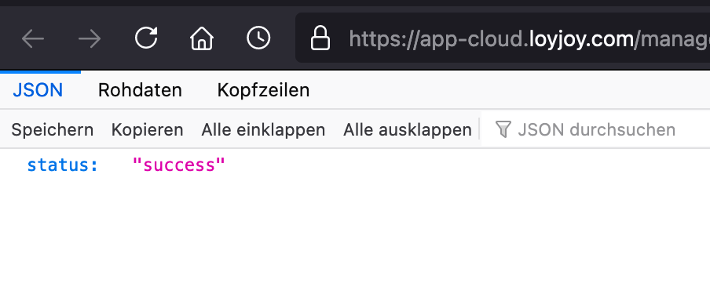
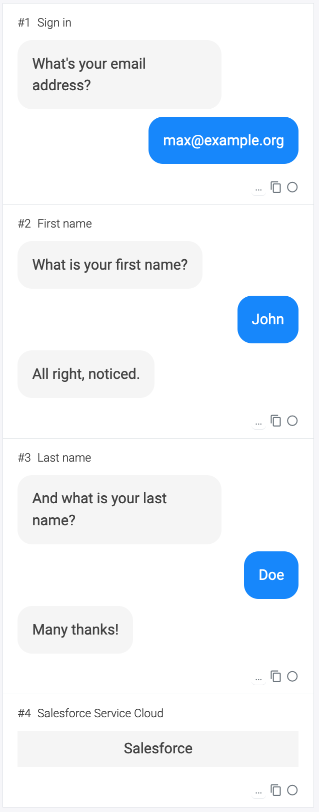
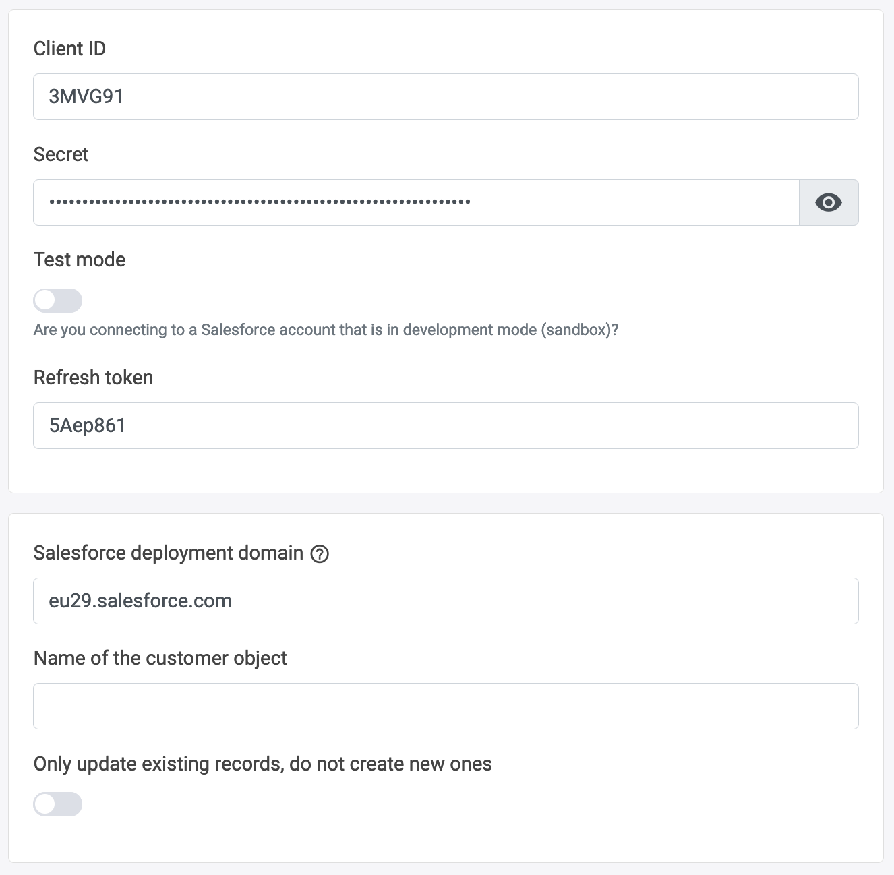
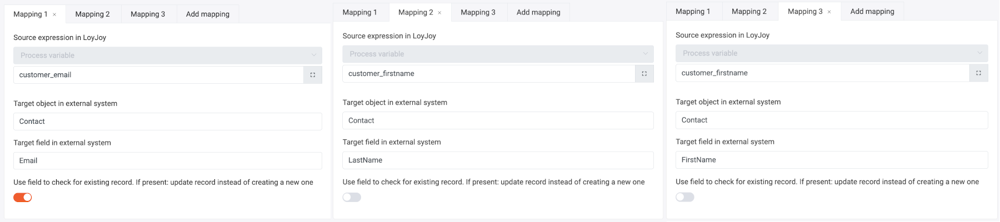

## Salesforce Service Cloud

Integrate Salesforce Service Cloud (SFSC) into your chat process. Use this module to transfer any kind of data from LoyJoy to Salesforce.

The module allows you to flexibly write objects in Salesforce. For example the `Person` or `Case` objects in Salesforce, but also custom objects. You can create new objects (add a new `Case`) or update existing ones (add the phone number to a `Person`). You just need the name of the object and the name of the field you want to write to configure the transfer.

To connect to SFSC, create a ConnectedApp that contains the authentication data required for the connection (see next section).

In this module, use mappings to configure which data should be written to which object:

### SFSC Configuration

You will need to create a ConnectedApp in SFSC for the connection to work.

From this connected app, you can then copy the client ID and secret:

LoyJoy needs the `api` and `refresh_token` OAuth Scopes. Additionally you need to set the Callback URL in the OAuth settings:

This is where you find the callback URL:

These are the required settings for the refreh token:

After you have adjusted the settings in SFSC you can authenticate LoyJoy by clicking this button:

You should see a message like this, showing that everything worked:

### Example

This is an example flow which first registers a customer, asks them for their first and last name and then creates / updates a contact in SFSC accordingly:

The connection is configured as described above:

There are three mappings: One for each of the fields to be mapped (email, first name, last name):

Like mentioned above, the email field is configured here to act as primary key in the connection to SFSC. Before creating a new contact, SFSC is queried for a contact with this email address. If one exists, it is updated with the data from LoyJoy. If not, a new contact with the data from LoyJoy is created.

By removing the checkbox "Use field to check for existing record" we could instruct LoyJoy to always create new contact objects.

