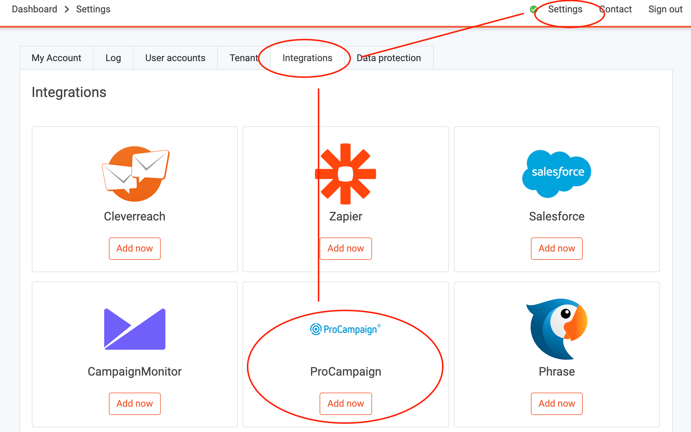
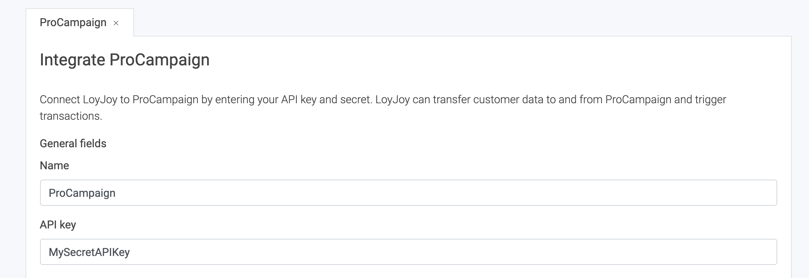
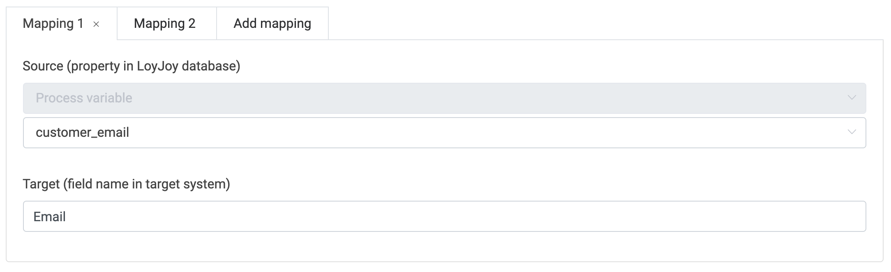

# How to transfer giveaway participants from LoyJoy to ProCampaign

## 1. What this solutions will do for you

LoyJoy lets you create a giveaway or raffle for your customers within the chat experience. Your customers will be asked to enter their email address in order to participate. In addition you can draw the winners on the platform and export them.

You can **automatically transfer your new giveaway participants to your ProCampaign database**. LoyJoy will forward the email addresses of your participants to ProCampaign.

## 2. What you need for this solution

To start transferring participants from LoyJoy to ProCampaign you will need three things - your ProCampaign administrator will help you with these:

 - The **Participation transaction name** in ProCampaign.
 - The **Participation list name** in ProCampaign.
 - The **API key that has the needed rights** to send the transaction.

## 3. Add the Giveaway participation process block to your chat flow

Create or copy an new experience and add the **`Giveaway participation`** process block. Also add the **`Sign up`** process block if your chat flow does not have one yet. The sign up process block collects the email adresses from your customers and is required for a valid giveaway participation. Please add the **`ProCampaign`** process block to your process flow too.

After adding the process block to your chat flow, close the process editor. The process block `Giveaway participation` gives you the opportunity to maintain multiple giveaways organized by tabs. Use the `timer button` in the right corner to set different give aways for different days. You can decide how many times one customer can participate to your giveaway and set a date to automatically draw a winner from your participants. Also set the number of winners that should be picked.

The section `Confirm participation by email` lets you define a confirmation email send to your customer after participating for your giveaway. If you wish to send a confirmation email, activate the button. Here you can set a subject line and a message to your customers. Use the HTML template field to paste your individual design and brand the confirmation email due to your preferences.

The section `Send winner email` can be used to notify the winner(s) of your giveaway. Here you can configure the winner email to inform the lucky participants about their price. Make sure to activate the **`Do not send winner email`** button as you want to send these emails from ProCampaign.

The section `Other texts` lets you define the intro messages to your customers in the chat to invite them to sign up for your newsletter. Then you can define a post-participation message send in the chat to confirm the participation (here: Done. You are now entering the competition. I keep my fingers crossed. :crossed_fingers: :trophy:) You can also 
define a message in case your customer has already participated and you only allow one participation per person. 

Now we configure our process block `ProCampaign` to transfer the data from LoyJoy to a corresponding transaction and data field in ProCampaign.

Awesome! :tada: You just created your first giveaway in the LoyJoy chat. One more step to go!

## 4. Configure the data transfer

You've completed all the configurations within the chat. Now you have to set up the data transfer.

On the LoyJoy platform, go to settings, then choose integration. Choose ProCampaign and click on "Add now".

This will add a new tab with the name "ProCampaign" below the cards.

Scroll down to "General settings".

Set a name for your integration (since you can have several integrations this will help you keep an overview).
Enter **your API key** that you got from your ProCampaign admin.

  

Scroll down to the section `Fields for giveaway participation`. Now fill in the **Participation transaction name** and the **Participation list name** into the according fields in LoyJoy. The field Participation privacy is not required and meant for special cases (to transfer the privacy attribute).

Scroll down and activate the integration for your bot in the field "Choose on which bots the integration should be active". Click on "Add a mapping" to create a mapping for the email field. Then choose `process variable` and type in **customer_email** to refer to your data field in your chat flow. Now just type in the source name of the data field in ProCampaign **Email**.

Congratulations! You just have successfully connected your LoyJoy chatbot with ProCampaign and all giveaway participants within the chat will automatically tranferred to ProCampaign.:tada:
