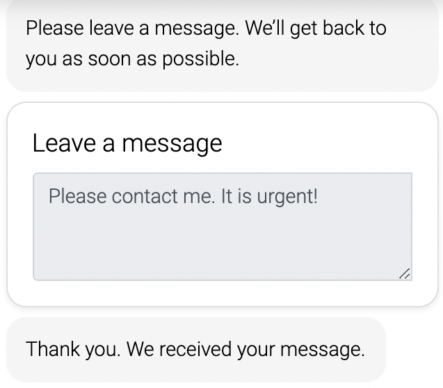

# Live Chat

With LoyJoy you can let human experts support your automated chat experiences. Best of all, always-on agents are not required! Get notified when customers are waiting in the Live Chat and join the conversation easily from the LoyJoy Cloud. It is the place where all your in-person conversations meet, ongoing or settled.

## How to set up the Live Chat

Now you are probably wondering how to set up and use the live chat. Just follow the next steps and you are ready to chat. It is very simple! 
 
1. Go to your experience and add the "Live Chat" process module to your existing chat flow

2. By clicking on the module and closing the process editor, you will see the following options:

3. <b>If no agent is available choose</b> 
 a) Exit - returns to chatflow and goes into the next process  
 b) Jump - choose where you want to send your customer if no agent is available  
 c) Asynchronous response - Give your customer the option to get contacted via mail  

4. Set <b>Waiting time in seconds for agents to respond</b> 
 a) Allows you to edit the time that the agents have to respond  

## How to use the Live Chat as agent
Once the user enters the "Live Chat" process module, the agents receives a message in their Live section and can reply. Agents can use animations and lead the user to a certain experience or sub-process if needed. Important: Agents must go live and mark themselves as online to interact with users online.
[Watch our short Live chat demonstration video.](https://www.youtube.com/watch?v=FFMvH-iQWho)

1. Go to the Live tab in the LoyJoy Cloud

2. Turn the switch and go online

3. Choose the relevant chat from the sidebar

4. Start chatting

## How to use the Live Chat as user
Once customers enter the live chat, the conversation is marked as "waiting" in the live section and an agent can take over the chat. When the live chat started it might look like this:

If no agent is available, users can leave a message and Email address:

## LoyJoy's Live Chat Benefits

1. Enabling live human interaction

2. Hybrid approach: automated process + human interaction

3. Jump back and forth between automated process and human interaction

4. Save costs by avoiding always-on agents
