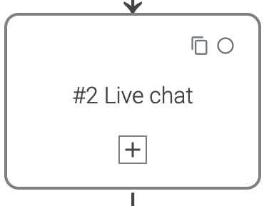
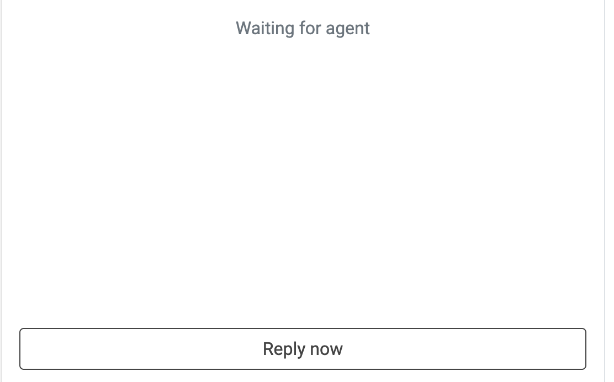
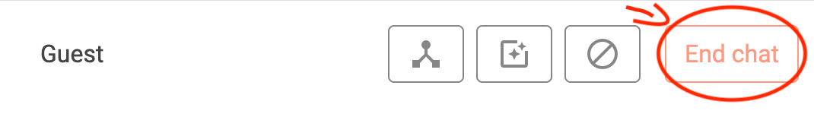
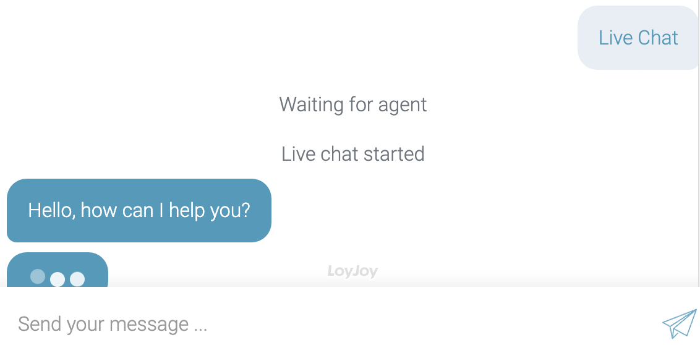
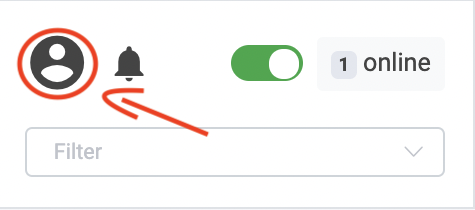
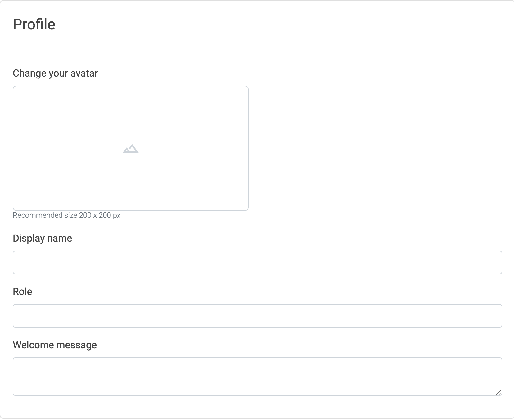
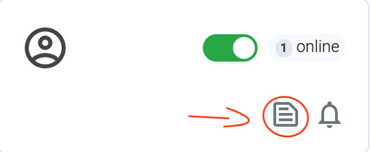
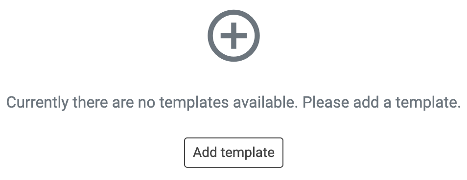

# Live 

With LoyJoy you can let human experts support your automated chat experiences. Best of all, always-on agents are not required anymore! Get notified when customers are waiting in the Live chat and join the conversation easily from the LoyJoy Cloud. It is the place where all your in-person conversations meet, ongoing or settled.

## How to set up the Live chat

Now you are probably wondering how to set up and use the Live chat. Just follow the next steps and you are ready to chat. It is very simple! 
 
1. Go to your experience and add the process module <i>Live chat</i> to your existing chat flow

2. When you close the process editor and click on the module, you will see the following options:

3. <b>If no agent is available choose</b> 
 a) Exit - returns to chatflow and goes into the next process  
 b) Jump - decide where you want to send your customer if no agent is available  
 c) Asynchronous response - Give your customer the option to get contacted via mail  

4. Set <b>Waiting time in seconds for agents to respond</b> 
 a) Allows you to edit the time agents have to respond  

## How to use the Live chat as an agent
As soon as the user enters the "Live chat" process module, the agents receive a message in their Live section and can reply. Agents can use animations and lead the user to a certain experience or sub-process if needed. Important: Agents must go live and mark themselves as online to interact with users.

1. Go to the Live tab in the LoyJoy Cloud

2. Flip the switch and go online

3. You get notified when a user is waiting in the Live chat

4. Choose the relevant chat from the sidebar

5. Click on _reply now_

6. Start chatting in-person

7. When you are finished chatting with your customer, simply click on _End chat_

## How to use the Live chat as a user
Once customers enter the live chat, the conversation is marked as "waiting" in the live section and an agent can take over the chat. When the live chat starts and the agent is writing you also see a typing indicator which might look like this:

If no agent is available, users can leave a message and mail address:

## How to unlock the full potential of the Live chat
The Live chat module has even more to offer for your customers! You can easily redirect them to another chat experience, sub processes or show them our awesome animations live in the chat. Read on to get the full benefits!

**1. Understanding the toolbar**
 You've seen this image before on how to end the chat. Now we want to dive deeper and see what's behind the three icons. 

<b>Jump to experience</b>
 Redirect a customer to any experience you have already created in your tenant.  
<b>Jump to sub process</b>
 Redirect the customer to another point of the experience. Useful to show how certain modules work. 

 **Example: Jump to NPS experience** 
Let's say a customer wants to see the NPS module in real-time. Just redirect them to any NPS experience you already created in your tenant. As soon as you've clicked on Jump to experience and chosen the relevant experience, the Live chat ends and the customer gets routed to the chosen experience.

**Send animation**

You can select from our list of animations and send them directly via the Live chat. The selected animation is then played in the chat of the user.

**Block user**

 There is also the possibility to block certain users from the Live chat.  

**2. Customize your profile**
 You can also customize the profile of your agent. It is possible to change your Avatar, display name, choose a role and set a custom welcome message 
1. To start, click on the avatar.

2. Here you can update and customize the settings for your profile.

**3. Manage templates**
 You can create and store custom templates to use in your chat to save valuable time! 
 1.Click on the icon selected below: 

2. Add a template

## Wrap-up: LoyJoy's Live chat Benefits

1. Enabling live human interaction

2. Hybrid approach: automated process + human interaction

3. Jump back and forth between automated processes and human interaction

4. Save costs by avoiding always-on agents
