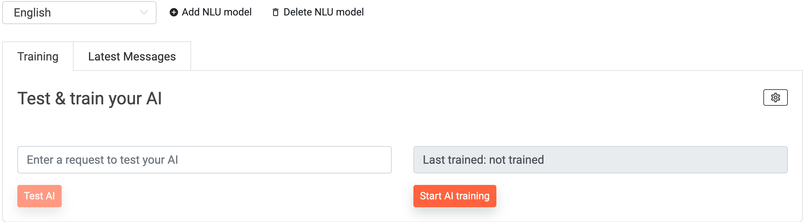

# What is NLU 

## NLU

 NLU stands for Natural Language Understanding. With the help of AI-based NLU, your bot can automatically respond to customer questions. Here you can train your own artificial intelligence and teach your bot new skills. Your chat experiences have a free text field in which customers can type their requests and comments. 

1. As soon as you click on NLU on the sidebar, you get the option to train your own NLU model. Choose your language and start training!
  

 2. In the following window you have the option to train and test your own NLU model. 

 3. It is also possible to manage your intents. Just enter a few sample sentences and define the correspondening answer of the bot. 

